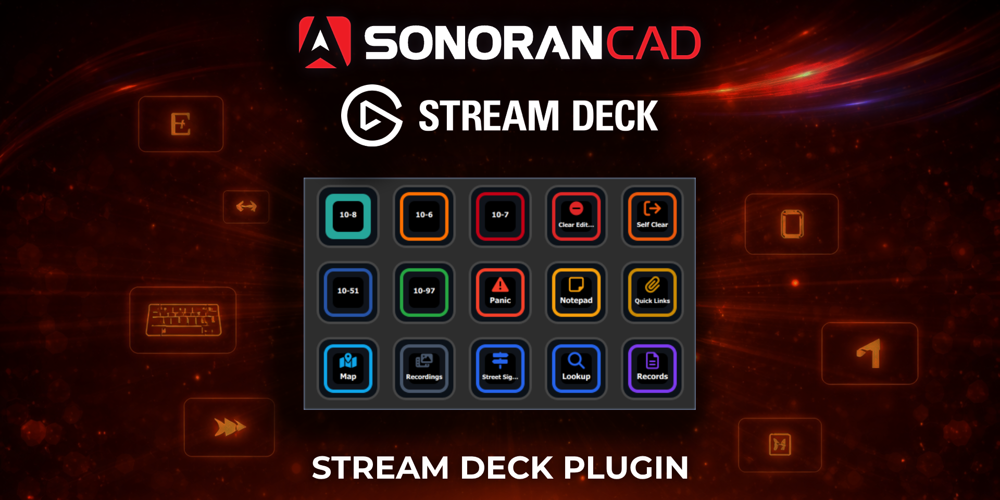
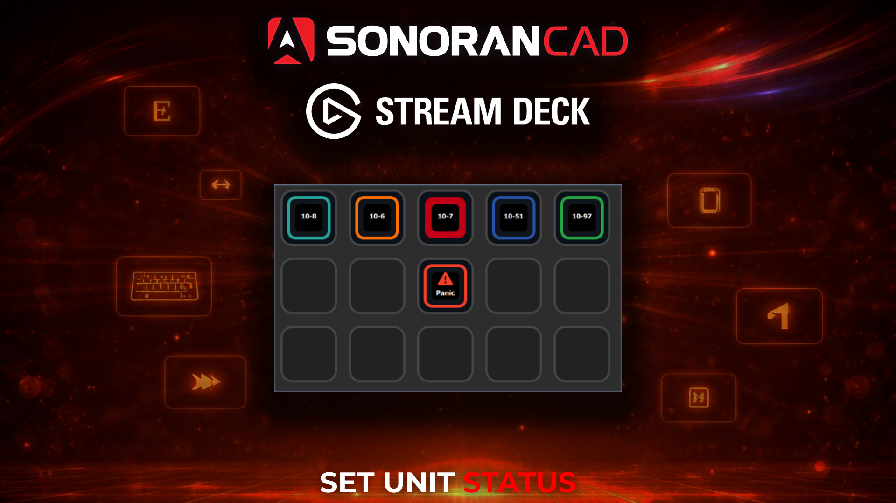
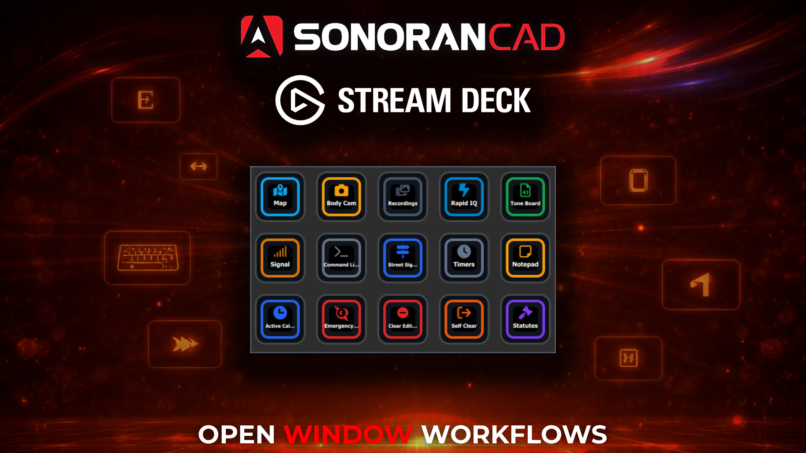
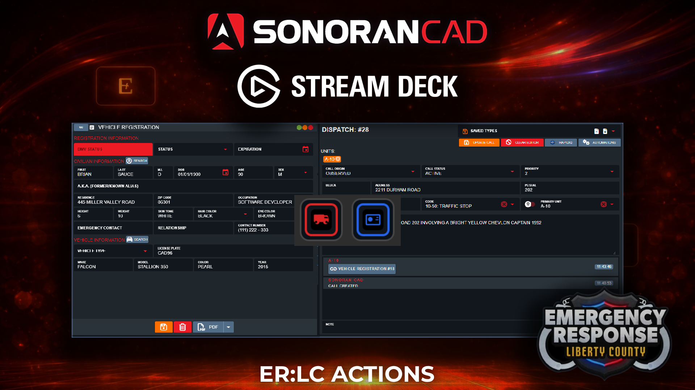

# ⌨️ Stream Deck Plugin

<figure><figcaption></figcaption></figure>

<figure><figcaption></figcaption></figure> <figure><figcaption></figcaption></figure> <figure><figcaption></figcaption></figure>

## Introduction

Sonoran CAD's MacOS and Windows desktop applications offer direct integration with [Stream Deck hardware](https://www.elgato.com/us/en/p/stream-deck). By installing our official Stream Deck plugin, users can customize layouts and buttons to control their CAD faster than ever before.

Don't have a physical Stream Deck? Download the [free Stream Deck Mobile app](https://www.elgato.com/us/en/s/stream-deck-mobile)!

## Installation

### 1. Download and Install the Plugin

Download the official [Sonoran CAD Stream Deck plugin from the Elgato Marketplace](https://marketplace.elgato.com/product/sonoran-cad-fcdbaa52-45cc-4569-89f2-c395d2ae8834).

<figure><figcaption></figcaption></figure>

Stream Deck will automatically install your plugin for use.

<figure><figcaption></figcaption></figure>

### 2. Configure Actions

Using the Stream Deck desktop application search for **Sonoran CAD** in the **Keys** section.

Drag-and-drop an action category to the Stream Deck. Select the action to update the sub-type.

Ex: **Status** action type > **Status Option** > **Panic**

<figure><figcaption></figcaption></figure>

## Action Capabilities

The Sonoran CAD desktop application must be running and signed in to a Police, Fire, EMS, or Dispatch page for actions to run.

### Status

Status buttons will automatically change labels based on your community's custom status buttons. Your current status option will show as a filled outline when selected.

* **Available**
* **Busy**
* **Unavailable**
* **Enroute**
* **On Scene**

### Panic

The **Panic** button will toggle your active unit's panic status.

The button will change from outlined to filled when a panic mode is active.

### Window

When pressed, these actions will open the corresponding window in the CAD.

* **3D Live Map -** [**FiveM**](in-game-integration/available-plugins/live-map.md) **or** [**ER:LC**](erlc/3d-live-map.md)
* [**Tone Board**](../tutorials/customization/tone-board.md) (Available to dispatchers or when Self Dispatch Mode is enabled)
* [**Rapid IQ**](../tutorials/dispatching/rapid-iq.md) (Opens in the active visible Call Viewer)
* [**Command Line**](../tutorials/dispatching/command-line-interface-cli.md)
* [**Street Signs**](in-game-integration/available-plugins/smart-signs.md)
* **Call Viewer**
* [**Lookup**](../tutorials/records-management/searching-for-records.md)
* [**Records**](../tutorials/records-management/)
* [**10-Codes**](../tutorials/customization/10-codes.md)
* [**Penal Codes**](../tutorials/customization/penal-codes.md)
* [**Quick Links**](../tutorials/customization/quick-links.md)
* **BOLOs**
* **Active Calls**
* **Emergency Calls** (Available to dispatchers or when Self Dispatch Mode is enabled)
* **Signal** (Available to dispatchers or when Self Dispatch Mode is enabled)
* **Timers**
* **Notepad**

### Bodycam

* **Open Bodycam** (Requires an active unit)
* **Record Bodycam** (Requires an active unit)
* **View Recordings**

### Other Actions

* **Clear Dispatch Editor** (Requires a visible Call Viewer)
* **Self-Clear** (Detaches your active unit from its current call)

The following actions run the corresponding ER:LC integration from a Police or Dispatch page:

* [**Traffic Stop**](erlc/traffic-stops.md)
* [**Plate Reader**](erlc/plate-reader.md)
