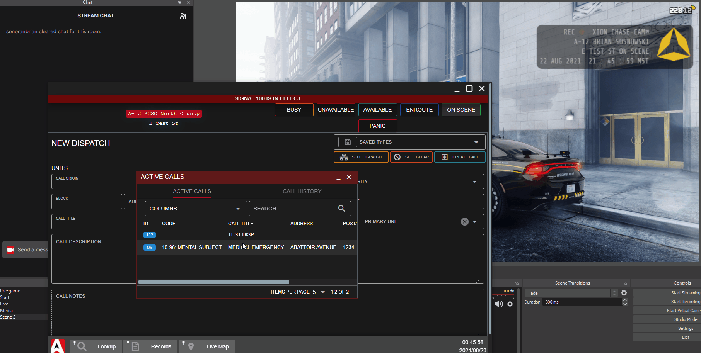

# 📺 Twitch Bodycam, Bot, & Lighting Integration

.gif>)

.png>)

.png>)

## What is Sonoran CAD's Livestream Overlay?

Sonoran CAD has a built-in livestream overlay, allowing you to display your live unit information, call information, and more!

Our Twitch bot can also be configured to send out chat messages when data is modified.

## Bodycam Overlay


The free version of the overlay does not include the customizable bodycam asset.\
However, you can still create [custom overlay text](twitch-overlay-and-bot.md#custom-overlay-text) with the free version!

Learn more about the [full version of Sonoran CAD's stream overlay](twitch-overlay-and-bot.md#purchasing-the-overlay)!

The bodycam creates local text files and hosts a local webserver.\
**This requires the **[**desktop **](../downloads/)**application to run.**


The stream overlay also includes a customizable version of the popular [XION Chase Cam asset](https://github.com/zhivotnoya/XION-ChaseCam).

This allows you to customize a bodycam overlay on your stream, with your real-time unit and call information.

### 1. Set a File Directory

**First, ensure you are using the **[**desktop **](../downloads/)**version of Sonoran CAD. **The application has to generate physical files, and host a local webserver to work. This can not be done in a browser.

In the stream overlay, open the txt file directory viewer and select a folder for the text files and bodycam webpage to be generated:

### 2. Configuring the Bodycam Contents

In the livestream overlay config section, expand the `Bodycam` section.

Here, you can enable and customize the data placement and keys just as before with the [customizable text files](twitch-overlay-and-bot.md#3-toggle-and-configure-keys).

* Expand the `Unit Updates` or `Call Updates` Section
* Toggle `ON` the txt file
* `COPY` the field key
* `PASTE` the field key into the bodycam section
* `SAVE` the configuration once complete

You can also optionally specify a different port for the bodycam webpage to run on (`9990` is the default).

.png>)

### 3. Add the Bodycam to OBS

In OBS, add a new "Browser" source and paste the URL listed in the bodycam section.\
By default, this will be `http://localhost:9990`

.png>)

Paste the URL into the browser source and hit OK.

.png>)

### 4. Customize the Size and Placement

You can now customize the size and placement of this browser window in OBS as you normally would.

## Smart Lighting

#### [Video Promo and Tutorial](https://www.youtube.com/watch?v=gs6RdZt3mUo)

.png>)

Sonoran CAD allows you to configure in-game events to smart lighting in your own home!

When you toggle your police lights in-game, your room can flash with custom lighting patterns to further immerse and simulate real world lighting.

### Supported Smart Bulbs

At this time, Sonoran CAD currently supports the following smart bulb types:

#### [Wyze Color](https://wyze.com/wyze-bulb-color.html)

Many of our development team members personally use and recommend these bulbs. Due to the design, these tend to provide the fastest response type with more complex lighting patterns. A 4 pack typically costs \~$40 ($10/bulb).

#### [Philips Hue](https://www.philips-hue.com/en-us/products/smart-light-bulbs)

Philips Hue is significantly more expensive, but is typically the most widely known option. This option will also require the purchase of a Hue bridge/hub. Due to the design, these tend to have a \~10ms+ delay when setting the color of multiple bulbs at a time.

We recommend keeping the `delay` for custom sequences > 500ms when using Philips Hue bulbs.

### 1. Searching for Bulbs

The smart lighting section has multiple `Scenes`

* `Restore`: Set when you are no longer flashing emergency lights, turn signals, etc.
* `Emergency Lights`: While you are in an emergency vehicle with the lights on
* `Panic`: While your panic status is toggled
* `Left Turn Signal`: While your left hand turn signal is on
* `Right Turn Signal`: While your right hand turn signal is on
* `Hazard Lights`: While your hazard lights are on

Expand the `Scene` > `Add Bulb` > `Search for Bulbs` > Select `Wyze` or `Philips Hue`

.png>)

#### Credentials: Wyze

The Wyze Color bulbs require your Wyze login credentials. This makes a simulated request to your homepage for all lights on your account. The Wyze credentials are not saved on both the local Desktop app or Sonoran CAD's servers. However, you may wish to update/reset your password, or even create a new Wyze account that shares these bulbs.

#### Credentials: Philips Hue

Your Philips Hue bridge should be automatically discovered by pressing the `Scan` button in Sonoran CAD.

If you are seeing the following error:\
`Error: Unable to find a Hue bridge on the local network.`

You may need to manually enter the bridge's IP address. This is most easily found using the Philips Hue mobile app.

1. Select Settings
2. Network Settings
3. Toggle `DHCP` Off
4. Copy the `IP address` to Sonoran CAD
5. Toggle `DHCP` On
6. Scan for the bridge in Sonoran CAD

.png>)

.png>)

### 2. Creating Sequences

You can add the desired bulb to your `Scene`. Each `scene` is made up of multiple `frames`.

The example below shows a very simple sequence of two lights switching back and forth between red and blue, with a `delay` of `500ms` between each frame. You can duplicate and create advanced chase sequences, flashes, etc. with several bulbs at a time.

We recommend keeping the delays no shorter than:\
`250ms` for Wyze Color Bulbs\
`500ms` for Philips Hue Bulbs

.png>)

### 3. Testing and Using In-Game

You can press the `Test Scene` button to test the scene with your smart bulbs. Press the `Test Scene` button in the `Restore` scene section to go back to your normal lighting.

#### Local Webserver: In-Game Use

For in-game use, your lights, turn signals, and hazards will automatically run as long as your community has the Sonoran CAD integration framework installed. This utilizes a [local webserver](../sonoran-cad/api-integration/api-endpoints/local-endpoints/smart-lighting.md) running from your desktop app.

1. If you have modified your Bodycam port from the default `9990`, you will need to update this port in-game as well. Use the `/setlightport <some port here>` command in-game to change your port from `9990` to something else.
2. Additionally, ensure you have set your file directory in the credentials section of the stream overlay.

## Configuring the Twitch Bot

Sonoran CAD's stream overlay also comes with a configurable Twitch bot. This bot will send out chat updates when unit or call data is updated.


The Twitch bot is **not included with the free version** of the Stream Overlay.\
\
[Learn more about the full version of Sonoran CAD's stream overlay.](twitch-overlay-and-bot.md#purchasing-the-overlay)


### 1. Create a Twitch OAuth Token

Create a new Twitch OAuth token by going to [https://twitchapps.com/tmi/](https://twitchapps.com/tmi/)

### 2. Configure your Twitch Bot Token and Username

Using the overlay in OBS, select the `Twitch Bot` button in the taskbar.\
Paste in your Twitch channel name and OAuth key.

.png>)

Once set, you can press `Test` to display a test message in your Twitch chat.

### 3. Configure the Bot's Event Data

Every piece of unit and call data can be toggled on or off individually.

**It is highly recommended to only toggle on data updates that will not be frequently spammed.** Toggling too many data fields and updating data too quickly may result in **Twitch rate limiting your bot.**

.png>)

### 4. Save and Run

Once you have configured your Twitch Bot's credentials and data fields, press `Save`.

Now, whenever one of those data fields is updated, your Twitch bot will send a chat message.

### Debugging the Twitch Bot

If you're having issues seeing the Twitch bot messages, view the `Twitch Logs` panel in the stream overlay.

This will contain valuable information on the twitch bot's connection, rate limiting, and other errors.

.png>)

If you have too many data fields toggled, and are sending Twitch updates too quickly you may experience rate limiting.

## Custom Overlay Text

The overlay is immensely customizable, allowing you to customize every piece of data displayed.

### 1. Accessing the Overlay Window

The overlay configuration modal can be opened by navigating to `Start Menu` > `System` > `Stream Overlay`. Or, by searching in the start menu.

### 2. Configuring Text File Location

While the Twitch bot can run in a browser instance of Sonoran CAD, the [desktop application](../downloads/) **is required**, to generate unit/call data txt files.

In the stream overlay, open the txt file directory viewer and select a folder for the text files to be generated:

### 3. Toggle and Configure Keys


The **free version** of the overlay is limited to three (3) data keys.\
Learn more about the [full version of Sonoran CAD's stream overlay](twitch-overlay-and-bot.md#purchasing-the-overlay)!


In the `Configuration` tab, toggle on the desired data fields for your unit and dispatch call information.

For every field toggled, a text file will be generated to be viewed in OBS.\
However, we **recommend creating custom text files** to combine multiple data fields in a single text file.

.png>)

#### Data Field Keys:

These can be easily copied from the UI, by pressing the `Copy` button next to the toggled field and pasting into the custom file's key textbox.

| Key                | Description               |
| ------------------ | ------------------------- |
| {unit_status}      | Unit Status               |
| {unit_location}    | Unit Location             |
| {unit_aop}         | Unit AOP                  |
| {unit_number}      | Unit Number               |
| {unit_name}        | Unit Name                 |
| {unit_agency}      | Unit Agency               |
| {unit_department}  | Unit Department           |
| {unit_subdivision} | Unit Subdivision          |
| {unit_rank}        | Unit Rank                 |
| {unit_group}       | Unit Group                |
| {unit_panic}       | Unit Panic Status         |
| {call_id}          | Dispatch Call ID          |
| {call_origin}      | Dispatch Call Origin      |
| {call_status}      | Dispatch Call Status      |
| {call_priority}    | Dispatch Call Priority    |
| {call_block}       | Dispatch Call Block       |
| {call_address}     | Dispatch Call Address     |
| {call_postal}      | Dispatch Call Postal      |
| {call_title}       | Dispatch Call Title       |
| {call_code}        | Dispatch Call 10-Code     |
| {call_description} | Dispatch Call Description |

### 4. Save your Configuration

Don't forget to save your configuration!

### 5. Configure Data in OBS

In OBS, add a new text source:

.png>)

In the text source properties, select `Read from File` and select one of your generated data key files from the [location specified earlier](twitch-overlay-and-bot.md#2-configuring-text-file-location).

.png>)

.png>)

You can now place the text field anywhere in your OBS stream layout.

You can also customize the fonts, change the background and more!

## Purchasing the Overlay

The free version of the livestream overlay allows anyone to test out the basic functionality. The free version does not allow use of the [Twitch bot](twitch-overlay-and-bot.md#configuring-the-twitch-bot), [bodycam](twitch-overlay-and-bot.md#bodycam-overlay), and is locked to a maximum of three custom "data keys".

The full version of Sonoran CAD's livestream overlay and Twitch bot is available for $7.99/mo.

Users can purchase a license to the full version in their billing center:


[create-and-manage-a-subscription.md](../pricing/faq/create-and-manage-a-subscription.md)


###
