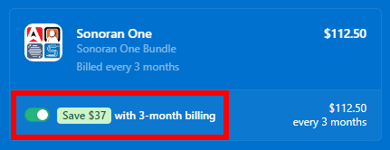

# Pricing FAQ

.png>)

Receive **free Sonoran CAD integration plugin installation**, **free Five PD installation**, and **30-100% off** every month when you [bundle with Sonoran Servers](broken-reference)!

Additionally, you can get **25% off** if you choose to purchase CAD, CMS, Radio, or Sonoran One as a **quarterly** subscription (available at Stripe checkout).

### Looking to compare plans?

[View our pricing page!](https://sonorancad.com/pricing)

### Looking to purchase a plan?


[create-and-manage-a-subscription.md](create-and-manage-a-subscription.md)


### How do I change what community my subscription is applied to?

At any time with an active subscription (including canceled subscriptions that are still active) you may change what community is benefiting from the subscription.

Simply change the [community ID](../../tutorials/getting-started/finding-your-community-id-and-authentication-code.md) on the active subscription to a new one.


[create-and-manage-a-subscription.md](create-and-manage-a-subscription.md)


### How do I cancel, upgrade, or downgrade my subscription?

You can cancel, upgrade, or downgrade your subscription at any time using the payment center.


[create-and-manage-a-subscription.md](create-and-manage-a-subscription.md)


### Are subscriptions a one-time payment, or monthly?

With Sonoran CAD, you have the option to choose either a monthly or quarterly subscription. We offer multiple different subscription levels at different price ranges. You can [compare our plans ](https://sonorancad.com/pricing)to see what works best for your community.

By choosing a **quarterly subscription**, you are given a **25% discount**. Simply select the **3-month billing** option at checkout and the discount will automatically be applied!

<figure><figcaption>
Sonoran Software - Quarterly Plan
</figcaption></figure>

Monthly subscriptions are renewed one month after the start date, and quarterly subscriptions are renewed three months after the start date. You will receive an email from Stripe a few days before you are charged again. This way, you aren't charged again without prior notice.

### Can I purchase a lifetime or yearly subscription?

Due to ongoing server hosting, development, maintenance, and customer support costs, we are unable to offer a lifetime subscription. All subscriptions are charged on a monthly or quarterly recurring basis. We do not offer yearly subscriptions, although we do offer **quarterly subscriptions at a 25% discount** as stated before.

### What payment methods are accepted?

We accept all major credit or debit cards through the in-app payment center. All payment processing is handled via Stripe.

### What happens if my subscription expires? Will I lose my data?

If your subscription expires, your CAD will automatically be downgraded to the free version. Your data will not be lost, but you will lose access to the additional customization or integration features that were included with your paid plan.

_Communities with no active logins for 30 days will be automatically removed._

### I purchased expert installation, how do I activate this?

If you've purchased [expert installation](expert-installation.md), simply reach out to our [customer support team](https://support.sonoransoftware.com).

### Refund and Purchase Policy

For more information on our refund and purchasing policy, click [here](../../other/policy/refund-and-purchase-policy.md).
