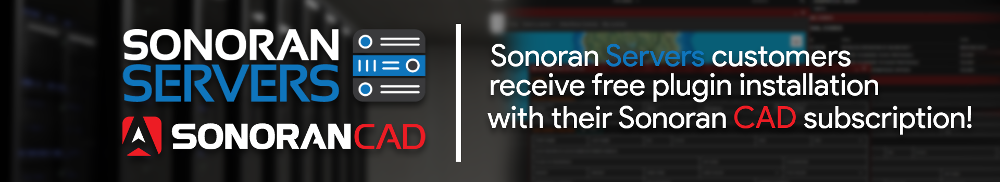

# Free Plugin Installation and Discount - Sonoran Servers

## Free Plugin Installation

### 1. Purchase a Windows Server Product from Sonoran Servers

If you haven't already, [purchase any server plan with Windows as the operating system from Sonoran Servers](https://info.sonoranservers.com/tutorials/windows-server/purchasing-and-getting-started).

### 2. Contact Support

Reach out on our [customer support site](https://support.sonoransoftware.com) and a team member will help install and configure your Sonoran CAD integration plugins for free!

## CAD: 30% off Discount


Sonoran Servers products that are less than $20/month are ineligable for this offer.


### 1. Purchase a Server from Sonoran Servers

If you haven't already, [purchase any ](https://info.sonoranservers.com/tutorials/windows-server/purchasing-and-getting-started)[server plan with Windows as the operating system](https://info.sonoranservers.com/tutorials/windows-server/purchasing-and-getting-started)[ from Sonoran Servers](https://info.sonoranservers.com/tutorials/windows-server/purchasing-and-getting-started).

### 2. Copy Your Server Account Information

1. [Login ](https://sonoranservers.com/index.php?rp=/login)to your sonoranservers.com account.

2. Open the "Services" panel.

3. Select your Server plan.

4. View and copy your server IP address.

### 3. Link Your Server Plan in Sonoran CAD

1. Open the [Sonoran CAD billing portal](accessing-the-payment-center.md).
2. On the CAD subscription you would like to apply the discount to, select "Bundle and Save"

3. Enter in your Sonoran Servers username, password, and IP address copied from earlier.


This Email and Password is the one you use to login to https://sonoranservers.com  
**NOT YOUR SERVER PASSWORD**


4. You will see your discount applied in the billing center. You can also select "Modify" and view your plan in the Stripe customer portal.

### Discount Information

One \(1\) 30% discount may be applied to one \(1\) Sonoran CAD subscription for every active Server plan with Sonoran Servers.

The 30% discount is applied to your Sonoran CAD subscription every month, for the lifetime of your Sonoran Servers plan.

Canceling your Sonoran Servers plan will remove the bundle discount from your Sonoran CAD subscription.

You may migrate the bundle discount to a different Sonoran CAD subscription at any time. Doing so will remove the bundle discount from the old Sonoran CAD subscription.

## Free Five PD Installation

We've partnered up with GTA Police Mods to be the official hosting provider of FivePD. Sonoran Servers customers can also receive free FivePD installation!

[Learn more about our free Five PD installation](https://sonoranservers.com/fivepd.php)!

