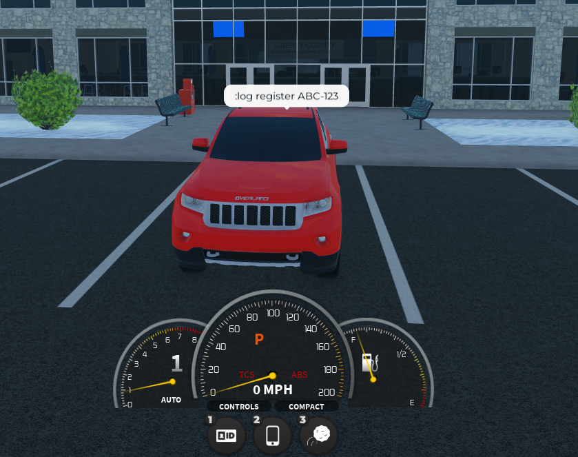

# Expert Installation


This service is in testing and has not yet been released!


## What is expert installation?

Our support agents are available 7 days/week to help install and configure all of your Sonoran CAD, CMS, and Radio plugins on your Windows server!

Expert installation is a one-time payment of $34.99 and covers a single install of Sonoran CAD, Sonoran CMS, and Sonoran Radio's addons/plugins.

## How do I purchase expert installation?

### At checkout:

When purchasing a new subscription for Sonoran CAD, CMS, or Radio; click `Add` on the `Expert Installation` option under `Add to your order` on the checkout page.

<figure><figcaption>
Expert Installation - Add to Order
</figcaption></figure>

### In the billing portal:

In the CAD billing portal, select `New Subscription` > `Expert Installation`

<figure><figcaption>
Expert Installation - New Purchase
</figcaption></figure>

## Requirements for Installation

* Windows VPS or Dedicated Server
* Windows RDP Access (shared with support agent)
* Sonoran CAD, CMS, or Radio subscription

## FAQ

### Can I redeem another product installation at a later date?

Yes! Your purchase is valid for an installation of one CAD, CMS, and Radio configuration. You could have the agent install and configure CAD plugins and install CMS plugins at a later date.
