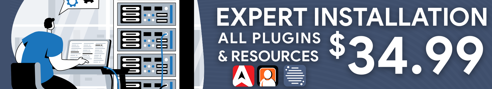

# Expert Installation

<figure><figcaption></figcaption></figure>

## What is expert installation?

Our support agents are available 7 days/week to help install and configure all of your Sonoran CAD, CMS, and Radio plugins on your Windows VPS or dedicated server!

Expert installation is a one-time payment of $34.99 and covers THREE (3) non-transferable installation credits.\
These credits can be used for:

* Sonoran CAD - Framework and Plugin Installation
* Sonoran CMS - Addon Installation
* Sonoran Radio - In-Game Radio and Addon Installation

## How do I purchase expert installation?

### For free:

Expert installation is offered to [Sonoran Servers customers for free](broken-reference)!

### At checkout:

When purchasing a new subscription for Sonoran CAD, CMS, or Radio; click `Add` on the `Expert Installation` option under `Add to your order` on the checkout page.

<figure><figcaption>
Expert Installation - Add to Order
</figcaption></figure>

### In the billing portal:

In the CAD billing portal, select `New Subscription` > `Expert Installation`

<figure><figcaption>
Expert Installation - New Purchase
</figcaption></figure>

## Requirements for Installation

* Windows VPS or Dedicated Server
* Windows RDP Access (shared with support agent)
* Sonoran CAD, CMS, or Radio subscription

## FAQ

### Can I redeem another product installation at a later date?

Yes! Your purchase is valid for three installation credits. You could have the agent install and configure CAD plugins and install CMS plugins at a later date.

### Is this purchase eligible for a refund?

All of our products are covered in our [48-hour moneyback guarantee](https://sonoransoftware.com/assets/files/internal/purchase_policy.pdf). However, this service is not non-refundable after the labor has been performed, regardless if one or all credits have been used.

### The support agent has installed my plugins, what's next?


[submodule-configuration](../../integration-plugins/in-game-integration/fivem-installation/submodule-configuration/)

