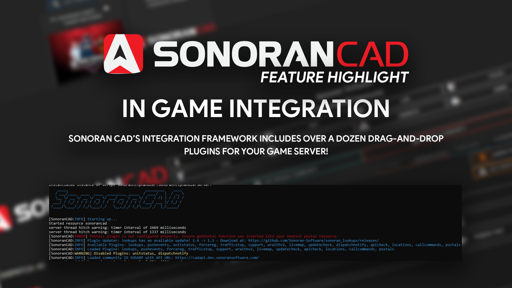

# v2.X.X - Legacy


Looking for VPS, web, or dedicated hosting? Check out our official [server hosting](../../other-products/server-hosting.md)!


<figure><figcaption></figcaption></figure>

### Framework Installation Guide

All Sonoran CAD plugins require our API framework installation. Installing our framework is easy! Learn more below.


[framework-installation.md](framework-installation.md)


### Plugin Installation Guide

All Sonoran CAD plugins follow a standard installation process. Learn more about installing plugins for your community below.


[plugin-installation](plugin-installation/)


### Available Plugins

View our vast array of our integration plugins, ready for drag-and-drop installation for your server!


[available-plugins](available-plugins/)


### Developer Documentation

Looking to write your own plugins for Sonoran CAD? Learn more about writing your own integration plugins and accessing our API documentation.


[api-integration](../../sonoran-cad/api-integration/)


