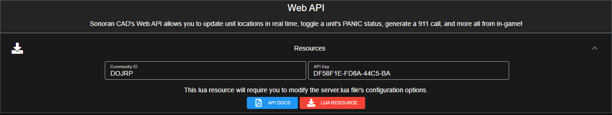

# Retrieving Your Credentials


API integration is not enabled with the free version of Sonoran CAD.  
For more information, see our [pricing](../../../pricing/faq/) or view how to check your community [limits](../../../tutorials/getting-started/view-your-limits.md).


### Retrieving Your Credentials

In the admin menu, select Advanced &gt; In-Game Integration

Under the Web API section, your community ID and API key will be listed as shown:



