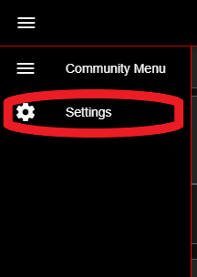
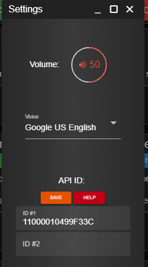

# Integration API ID


API IDs are set individually per community. Your API IDs on one community will not transfer over to another.


### Editing Your Account's API ID

#### 1. In the side menu, select open the settings modal:

#### 2. Paste in your API ID and Press Save


Sonoran CAD's [API ID plugin](../../../integration-plugins/integration-plugins/available-plugins/api-id-checker.md) automatically checks in-game if your API ID is properly set, and also event includes a command to get your proper API ID!


Typically, your API ID will be your **Steam Hex** as shown below. This is how our public [plugins ](../../../integration-plugins/integration-plugins/available-plugins/)are currently structured.  
  
However, your community may choose to integrate their own identifier system with custom API integration scripts. If this is the case, you will need to ask an administrator from your community for what to enter.

