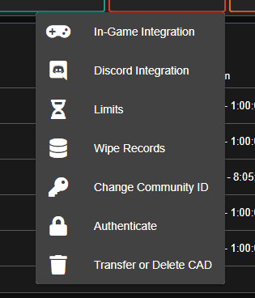

# Deleting or Transferring your CAD

_\*\*\*\*_

                             _**PLEASE NOTE:**_ _Only the community owner can delete or transfer the CAD!_

\_\_

                                                  1. Please make your way to the Community Menu

                                                                                  

                                                                                2. Click **ADMIN**

                                                 

                                               3. Click **ADVANCED** \(A dropdown menu will appear\)  

                                                                      

                                                                  4. Click **Transfer or Delete CAD**

                              

                     

                       5.  From this point, you will need to either select **TRANSFER CAD** or **REMOVE CAD**

Once you have chosen an option, you will be **required** to verify your email. \(This will be the email you originally signed up for the CAD with.\) After verification, your CAD/Community will be either deleted or transferred. This will be based off the option you chose earlier. 

\*\*\*\*

**PLEASE NOTE:** Once a CAD is deleted, there is NO WAY for us to recover it. Please consider this before making your choice.

As always, if you have any issues, please do not hesitate to reach out to our support team! Click [HERE ](https://support.sonoransoftware.com/#/)to be directed to our support page.

