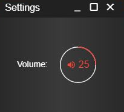

# Advanced Query Strings

### Force Mobile

| String | Usage | Description |
| :--- | :--- | :--- |
| forcemobile | app.sonorancad.com/\#/?forcemobile=TRUE | Your CAD will forcefully format the emergency services action bars to mobile format. This is beneficial for communities that are embedding the CAD in-game on a smaller format that does not quite meet the standard mobile dimensions. |

### Default Audio Level

| String | Usage | Description |
| :--- | :--- | :--- |
| audiolevel | app.sonorancad.com/\#/?audiolevel=25 | Your CAD audio settings will be set by default to the value provided. This is beneficial to communities that are embedding the CAD inside of a resource, and may wish to mute the audio by default. |

