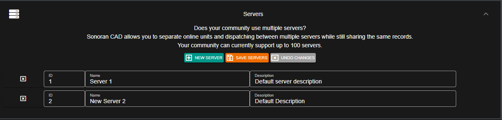

# Configuring Multiple Servers


The free version of Sonoran CAD is limited to one (1) server.\
For more information, see our [pricing](../../pricing/faq/) or view how to check your community [limits](../getting-started/view-your-limits.md).


### Configuring An Additional Server

In the Admin Customization menu, expand the "Servers" section to add, edit, or remove additional servers in your CAD.

### Changing Servers in the CAD

#### Civilian Page

In the civilian page, the top right header allows users to swap back and forth between servers.

 (1) (1).png>)

#### Emergency Pages

In the police, fire, EMS, and dispatch pages; users can select their server by clicking on the start menu.

 (1) (1) (1).png>)
