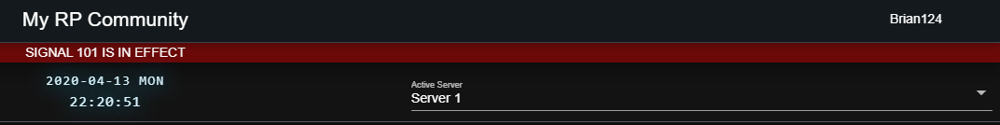

# Configuring Multiple Servers


The free version of Sonoran CAD is limited to one \(1\) server.  
For more information, see our [pricing](https://sonorancad.com/app/#/pricing) or view how to check your community [limits](../getting-started/view-your-limits.md).


### Configuring An Additional Server

In the Admin Customization menu, expand the "Servers" section to add, edit, or remove additional servers in your CAD.

### Changing Servers in the CAD

In the top right header, a drop-down menu allows users to swap back and forth between servers.

