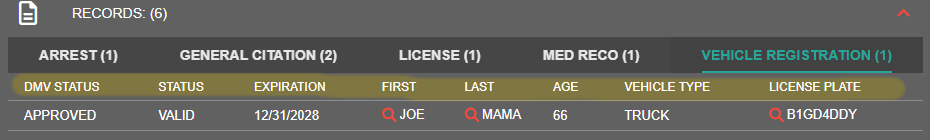

# Creating Custom Record and Report Types


Custom record and reports are limited based upon your subscription version.\
For more information, please view our [pricing page](../../pricing/faq/).


<figure><figcaption></figcaption></figure>

Sonoran CAD allows your community to create custom records and incident reports for police, fire, and EMS services. This tutorial will cover the basics of creating a new custom report or record and general usage of the system.

## Video Tutorial

View our [video tutorial](https://youtu.be/UclCEnm5FHM) on creating custom reports and records.

## Creating a new Report or Record:

### 1. Navigate to the Record Editor

Navigate to `Admin > Customization > Custom Records`

### 2. Select the new Record Type

From the "New Record Type" dropdown, select the desired record type.\
\
Records follow the standard record editing and lookup system, and require a civilian or vehicle field to be searched.\
\
Reports can be searched in the unit's report center via number or identifier.

### 3. Add Custom and Pre-made Sections

Add your desired custom and premade sections, edit fields, and more!

If your section is a custom character or vehicle field, you can toggle on the search button. This allows the section to be filled via when creating a new one. [Learn more about ensuring civilian and vehicle searches link to your custom record fields](creating-custom-record-and-report-types.md#linking-vehicle-and-character-searches).

The enable duplicate button allows users to click and create a new copy of the section while filing the record.

.png>)

Field Types

**Text**

These fields are generic text boxes.

#### Select

The select field allows you to customize a dropdown box.

#### Text Area

The text area field allows you to create a large text area.

#### Checkboxes

The checkboxes type allows you to create multiple checkboxes.

#### Date

The date field allows you to specify a date field. You can also specify the formatting in the mask column.

When `readOnly` is selected, this field will auto-fill the current date for new records.

The time field allows you to specify a time field.

#### Image

The image field allows you to specify an image to be displayed.

#### Linked Records

The linked records field allows you to link and cross-reference other records and reports to this record.

#### Flags

Custom flag options can be added to every record template. When checked, these flags will show up as alerts on any lookup. Similar to a checkboxes section, you will need to expand the section and add options.

#### Label

Labels can display static text, along with color attributes.

#### Address

The address dropdown will auto-filter [street address names that have been imported via CSV](addresses-and-street-names.md).

**Unit Information**

The `UNIT_NUMBER`, `UNIT_NAME`, `UNIT_RANK`, `UNIT_AGENCY`, `UNIT_DEPARTMENT`, `UNIT_SUBDIVISION`, `UNIT_AGENCY_LOCATION`, `UNIT_AGENCY_ZIP`, and `UNIT_LOCATION` field types will all automatically insert the unit's information when they create a new record.

Field Options

#### Preview

This will show the field label and value in the lookup table preview.

.png>).png>)

#### Supervisor

This will disable the field for all non-supervisor unit identifiers.\
Your unit's supervisor status can be set in the unit identifier editor.

#### Required

Required fields will require the unit to enter something into the field before the record can be submitted.

#### Unique

Unique fields enforce that no duplicate values for this field are stored in the database. These values are enforced for the specific record template only.

Unique fields can only be on non-DB Sync records and in custom sections.

**Read Only**

Read only fields prevent the user from entering new or modified text. This is used for auto-filled fields like unit information when a new record is created.

Note: The `date` and `time` fields will auto-fill with the current date/time if `readOnly` is toggled, based on the [community's timezone](community-branding-and-info.md).

Field Mask

The field mask allows you to specify a required format for the field.

* `#`: Number
* `S`: A-Z Letter
* `X`: Alphanumeric

#### Example: Numbers

Specifying `###` allows the user to only enter 3 numbers in the field.

#### Example: Phone Number

Specifying `(###) ### - ####` formats the user's input into a phone number.

Field Size

The field size slider allows you to select a field size value between 1 and 12.Every row of a record has a space divisible by 12.

 (1).png>).png>)

Dependencies

Dependencies allow you to make an individual field or entire section visible based on conditions.

**Copy Parent Field ID**

Expand a field and copy the unique `Field Mapping ID`.

.png>)

**Set Child Dependency**

On a section or field, click the dependency button to open the editor.

Paste the unique `Field Mapping ID` from before. The box will light up green when a valid ID is entered.

 (1).png>).png>)

Checkbox or Select fields as the dependency parent will allow you to select what values will display this section or field.

Text fields as the dependency parent will allow you to enter what text values will display this section or field.

#### Dependency Types

There are multiple options for dependency types.

* `Equal`
  * Dependency will display if the entered content are an exact match to the specified value(s)
* `Not Equal`
  * Dependency will display if the entered content is NOT equal to the specified value(s)
* `Contains`
  * Dependency will display if the entered content contains any of the specified values(s)

### 4. Save the Record

Be sure to set the record name, and press SAVE

.png>)

## Using your new Record Type

In the police, dispatch, fire, or EMS page you can now [add ](../records-management/adding-a-criminal-record.md)or [search ](../records-management/searching-for-records.md)for the new record type.

## Using your New Report

### 1. Accessing the Reports Center

In the police, dispatch, fire, or EMS page, select "REPORTS" in the top action menu bar\
From here, you can create a new report, search existing reports, and view reports requiring supervisor actions.\

.png>)

### 2. Creating a New Report

Select "New Report" and the desired custom report type from the dropdown button\
From there, you can fill out the fields and add the record.


If the "NEW REPORT" button, or actions on the report viewer are disabled, you are missing the [permissions ](../getting-started/permissions.md)to do so.


.png>)

### 3. Supervisor Panel

The supervisor panel shows all reports that have a blank field that requires supervisor permissions.\
If you do not have the supervisor panel enabled, you will need to have the [supervisor permission granted on your account](../getting-started/permissions.md).

## Updating Old Records with New Preview Fields

Many communities decide to enable a custom field for preview _after_ many records of that type have already been created.

Ex: Adding a previewed field to show the license "Type"

Communities can process a manual updating of historical records in the custom records menu.

 (1).png>)

 (1).png>)

### How does the re-sync work?

Sonoran CAD will search for all records of this type and attempt to automatically update any historical records with the latest preview field preferences.


Because Sonoran CAD records are entirely customizable, changing the field UID (unique ID) from one revision to the next will result in a failure to match and update the preview field.

\
Database sync records do not have the option to re-sync, as they will always be up-to-date.

\
A re-sync is only available once per 10 minutes.


## Linking Vehicle and Character Searches

Custom records allow the addition of a character and vehicle search button in sections. Clicking these allows the user to search and import a vehicle or character into the record section.

<figure><figcaption>
Custom Record - Vehicle and Civilian search sections
</figcaption></figure>

Character and vehicle searches will not fill out fields in your record if the record field UIDs are incorrect.

In order for these searches to properly place the vehicle and civilian record in your custom record fields, specific field `uid` values must match.

### Civilian Field UIDs

The default `Civilian` record has the following field UIDs:

`first` `last` `mi` `dob` `age` `sex` `aka` `zip` `occupation` `height` `weight` `skin` `hair` `eyes` `emergencyContact` `emergencyRelationship` `emergencyContactNumber` `residence`

 (1).png>)

When creating your custom record section with civilian search imports, those field UIDs will also need to match. The image below shows a custom record with the civilian search section toggled with the matching field UIDs.

.png>)

### Vehicle Field UIDs

The default `Vehicle Registration` record has the following field UIDs

`type` `plate` `make` `model` `color` `year`

.png>)&#x20;

&#x20;When creating your custom record section with vehicle search imports, those field UIDs will also need to match. The image below shows a custom record with the vehicle search section toggled with the matching field UIDs.

.png>)

## Common Issues

### ERROR: This record template has no fields enabled for preview.

You may encounter this error whilst attempting to save a custom record template.

"Preview Fields" are what show up when you run a record lookup (first, last, age, plate, etc.). The image below shows an example of "preview fields" on a vehicle registration record.

<figure><figcaption>
Sonoran CAD - Preview Fields Example (Shown in Yellow)
</figcaption></figure>

We require at least one field to be enabled for preview, as running a lookup with no preview fields would return a blank list of records.

To designate a field as a "preview field", simple toggle the magnifying glass icon in the custom record editor, as shown below.&#x20;

<figure><figcaption>
Sonoran CAD - Enable Field for Preview
</figcaption></figure>
