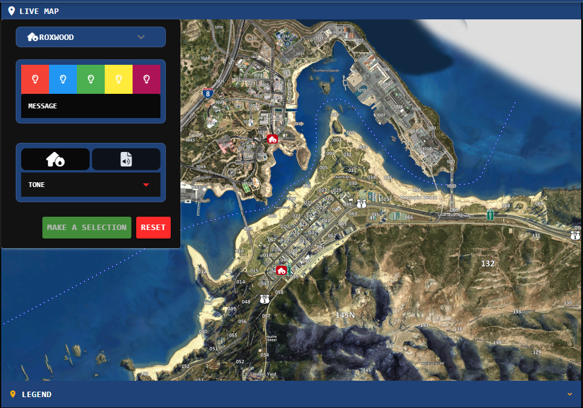

# Custom Dispatch Call Formats

## What are Custom Call Formats?

Dispatch calls are created by filling out several form fields such as status, title, description, attached units, and more. Some communities and localities may have different names for these input boxes. Or, some communities may wish to add or remove additional fields.

Sonoran CAD lets communities customize the exact fields shown in their dispatch call editor.

## Customizing the Call Format

Under **Admin** > **Customization** > **Dispatch Call Layouts** > communities can add or remove sections along with fields inside the sections.

Once configured, dispatchers can switch between layouts directly in the call editor.

Formatting for Call ID numbers can also be customized under [Geographical Customization](geographical-settings.md).

<figure><figcaption></figcaption></figure> <figure><figcaption></figcaption></figure>

