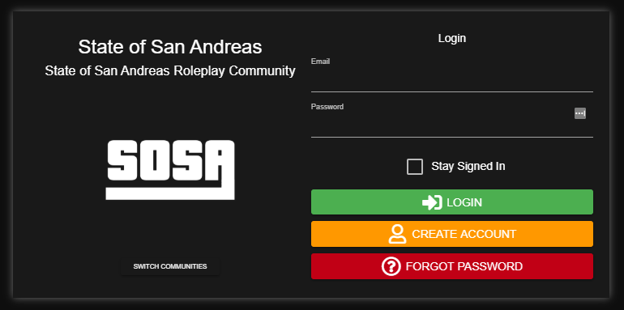
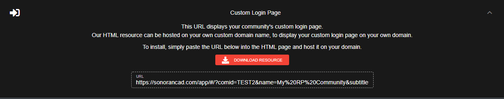

# Custom Login Page


Custom login pages are not supported with the free version.  
For more information, see our [pricing](../../pricing/faq/) or view how to check your community [limits](../getting-started/view-your-limits.md).



Looking for VPS, web, or dedicated hosting? Check out our official [server hosting](../../pricing/vps-hosting.md)!


The custom login page allows your community members to register, sign-in, and access your CAD all on your own domain!

#### 1. Download the HTML File

In the Admin Customization menu, expand the "Custom Login Page"  
Press the "Download" button to download our HTML file.

#### 2. Edit the HTML File

Copy, paste, and save the formatted URL from Sonoran CAD into the HTML file.

#### 3. Host the HTML File

Now that you've saved the custom URL inside of the HTML file, you can host this with your own domain on your own web server. Users can now register and access your CAD from your custom domain, and will even receive your [custom branded emails](custom-emails.md) for account actions.

