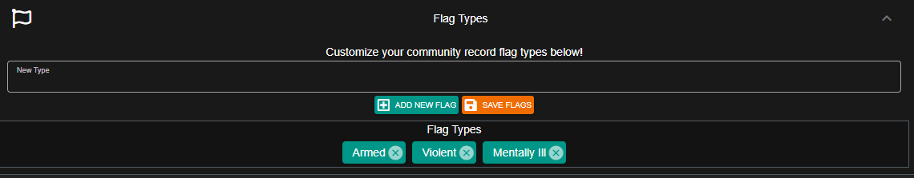

# Custom Record Flag Types


Community customization is not included with the free version.  
For more information, see our [pricing](https://sonorancad.com/app/#/pricing) or view how to check your community [limits](../getting-started/view-your-limits.md).


### Custom Record Flag Types

In the admin customization menu, you can add or remove record flag options:

These flag type options will then be displayed at the top of records:

