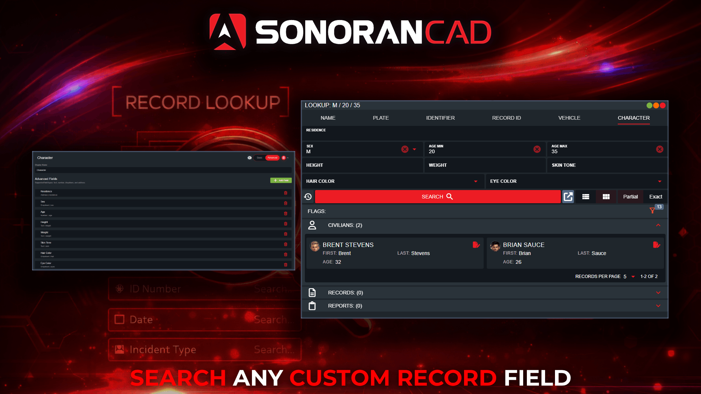

# Custom Search Types

## Custom Lookup Types

With Sonoran CAD’s custom records, communities can define custom lookup types that enable users to search records using tailored criteria.

Example: Vehicle Search — locate a registration by attributes such as make, model, color, etc.

<figure><figcaption></figcaption></figure>

## Configuring Lookup Types

Lookup Types can be customized under **Admin** > **Customization** > **Customization** > **Lookup Types**

### Basic Lookup Types

Basic lookup types allow you to search based on a single record field.

In this example, we will create a lookup type to look for a civilian character's SSN (Social Security Number).

1. Add Lookup Type

Select **Add Lookup Type** at the bottom of the menu.

Enter the lookup name, **SSN**.

<figure><figcaption></figcaption></figure>

2. Select the Record Field

Select the **Record Field** button. This will open a dialog to select a specific record field. Once selected, this field will be searchable when opening a record lookup.

<figure><figcaption></figcaption></figure> <figure><figcaption></figcaption></figure>

3. Optional: Re-Index Record Fields

Whenever a record is created or updated, any fields tied to custom lookup types are re-indexed in the database. These indices are what power custom lookup queries.

To ensure records created before a custom lookup type existed are included, [those records must be re-indexed](custom-search-types.md#re-index-records).

### Advanced Lookup Types

Advanced lookup types allow you to search based on multiple record field criteria at once.

In this example, we will create a lookup type to look for a character based off of optional address, height, weight, skin color, etc.

1. Add Lookup Type

Select **Add Lookup Type** at the bottom of the menu.

Enter the lookup name, **Character**.

Toggle the mode to **Advanced**.

<figure><figcaption></figcaption></figure>

2. Select the Record Fields

Advanced lookup types work the same as basic lookup types, but allow for more than one criteria.

* Select the **Add Field** button.&#x20;
* Enter a **Field Label** (Address).
* Select the **Record Field**. This will open a dialog to select a specific record field.

<figure><figcaption></figcaption></figure> <figure><figcaption></figcaption></figure>

Repeat the steps above to add as many search fields as desired.

4. Additional Field Options

**Requirement**

Toggle **Requirement** from **Optional** to **Required** to force users in the lookup window to enter data into this field prior to running a lookup.

**Width**

The **Width** determines how wide the search field is in the lookup window. For custom search types with several search fields, this can be used to condense the UI.

Width values range from 1-12, with 12 being full-width.

Select the **Preview** button at the top of the section to see the layout of your custom lookup type. Fields can be reordered via drag-and-drop.

<figure><figcaption></figcaption></figure>

**Range Search**

Text fields with a mask restricting input to numbers only (`#` symbol) will display the option to enable a range input. This allows users to search based on minimum and maximum number values.

Ex: Search by minimum and/or maximum age.

**Placeholder**

Placeholder text will be displayed inside the lookup field when empty.

**Mask**

Custom text input search fields can have a mask applied to enforce a specific format of numbers, symbols, letters, etc.

3. Optional: Re-Index Record Fields

Whenever a record is created or updated, any fields tied to custom lookup types are re-indexed in the database. These indices are what power custom lookup queries.

To ensure records created before a custom lookup type existed are included, [those records must be re-indexed](custom-search-types.md#re-index-records).

## Re-Index Records

Whenever a record is created or updated, any fields tied to custom lookup types are re-indexed in the database. These indices are what power custom lookup queries.

To re-index all existing records, select **Re-Index All Records** at the top to start this process.

Depending on the number of custom records in your community, this may take some time. **Record re-indexing can only be performed once per 12-hours.**

<figure><figcaption></figcaption></figure>

## Lookups Across Multiple Record Types

When a custom lookup type is configured with a linked field, the system uses the **Field Mapping ID** to determine which database fields to query.

The **Field Mapping ID** defined in the lookup type is shown in the **Record Field** selector. Any [custom record type](creating-custom-record-and-report-types.md) containing a field with the same **Field Mapping ID** will be included in the search.

<figure><figcaption></figcaption></figure> <figure><figcaption></figcaption></figure>

## Database Sync Configuration

Database Sync Configuration

If the search field is provided by your in-game database with [database sync](../../integration-plugins/database-sync-and-merge/), this custom record column will be display in your database sync configuration for any character, license, or vehicle registration.

This will then allow you to search characters, licenses, or vehicle registrations from your in-game database based on this custom column value.

.png>)

