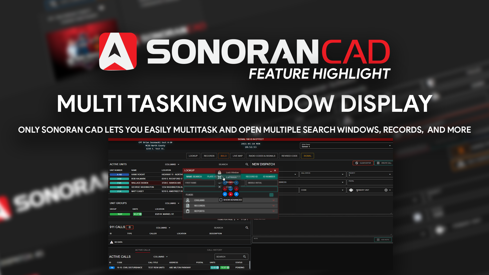
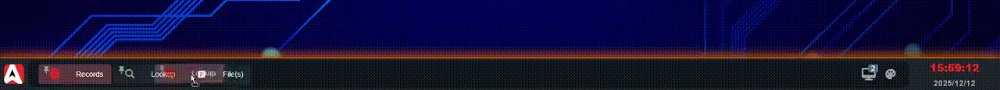

# Customizing Your Layout

## Getting Started


By default, "[Classic Layout](customizing-your-layout.md#enable-classic-mode)" is enabled in the customization menu.

To customize your dispatch/unit panel layout, you will need to [disable this](customizing-your-layout.md#8-classic-layout).


<figure><figcaption></figcaption></figure>

### Context Menu Options

You can right click on any panel and to reveal multiple menu options.

1. [Lock/Unlock Window](customizing-your-layout.md#4-locking-unlocking): This locks and saves the window's position into place.
2. [Quick Resize](customizing-your-layout.md#2-quick-resize): This opens the quick resize tools for the window.
3. [Change Desktop](customizing-your-layout.md#multi-desktop): Move the window to a different desktop.
4. Bring to Top:  This brings the window in front of any other open windows.
5. Minimize: This minimizes the window to a tab at the top of your screen.
6. Close: This closes the window.

<figure><figcaption></figcaption></figure>

### Quick Resize

Windows can be resized and positioned in multiple ways:

You can select one of the quick positions to move the window to one of the 9 quadrants on your screen. Or, toggle "Show Advanced" to specify the window's dimensions and positions down to the pixel.

Additionally, you can hover over the top edges of the window to click and drag the size.

.png>)

### Dragging to Position

Popout windows like a lookup, 10-code sheet, etc. can all be easily dragged and resized using the top header in addition to the quick resize tools.

Popout windows with in quick resize enabled or unlocked required windows (dispatch call editor, etc.) can be dragged simply by clicking and dragging anywhere on the window.

### Locking/Unlocking

When a window is locked into place it can no longer be moved. Additionally, the size and positioning is saved locally to your device and will persist after a refresh or relog. You can lock or unlock the window by right clicking on the window.

### Taskbar

#### Search Box

The task bar can be opened with a configurable [hotkey](https://app.gitbook.com/@sonoran/s/sonoran-software/~/drafts/-MeOE39Q3hdjvmYX_1Gy/tutorials/other-features/configurable-hotkeys) or with our [Streamdeck](https://app.gitbook.com/@sonoran/s/sonoran-software/~/drafts/-MeOE39Q3hdjvmYX_1Gy/integration-plugins/stream-deck-integration) integration. When opened, a search bar will be automatically focused on all non-mobile devices.‌

Here, you can search to quickly filter options. When the results have been filtered down to a single window, the search label will turn green indicating the window shortcut is available. Simply press `ENTER` to open the window.

.png>)

## Multi-Desktop

Add additional desktops for more window space. Access the desktop menu in the right of the taskbar.

Quickly swap between desktops using [hotkeys](../other-features/configurable-hotkeys.md).

<figure><figcaption></figcaption></figure>

## Customization Menu

Access the customization menu from the taskbar, or from the start menu.

<figure><figcaption></figcaption></figure>

<figure><figcaption></figcaption></figure> <figure><figcaption></figcaption></figure>

### Reset Layouts

If something goes wrong or you just want to start fresh, you can reset your saved layouts in the layout customization menu.

Simply right click on the empty area in the taskbar, or navigate to Start > System > Customization

#### Positioning

The taskbar is a desktop style action bar that will contain the "Start Menu" (Sonoran CAD logo) and your active/pinned tabs.

The taskbar can be positioned on the top, bottom, left, or right of your screen.

### Tab System

Sonoran CAD's advanced tab system allows for efficient window management and quickly accessing new programs.

<figure><figcaption></figcaption></figure>

**Drag-and-Drop:** Tabs can be dragged and dropped into new positions for organization. Pinned tabs will save their ordering past a refresh.

**Duplicate Windows:** When more than one window of the same type is minimized, the tab will show the number of minimized tabs in the top right. Clicking on a tab with more than one window minimized will display a menu allowing you to select a specific tab or open an entirely new one.

**Pinned Tabs:** Tabs can be pinned to the taskbar by right-clicking and selecting "Pin to taskbar" on the context menu. Pinned tabs will save their ordering past a page refresh. Pinned tabs with no actively minimized windows will be displayed as a lighter grey. Clicking on a pinned tab with no actively minimized windows will open a new window of that type.

**Icon and Label:** Tabs can be set to display as an icon, text, or both. This is toggleable in the customization menu.\
&#xNAN;_&#x4E;ote: Text will only be displayed if the taskbar is in the top or bottom screen position._

### Classic Layout

For some users, modifying the positions of dispatching panels may be too complicated. You can easily toggle on the "Classic Layout" to have the call windows automatically placed and responsive. Don't worry, popout windows can still be moved around and locked into place as normal.

#### Change Taskbar and Button Position(s)

Don't forget, you can easily [move the taskbar to the top or sides of the screen](customizing-your-layout.md#6-taskbar), [change what buttons appear](customizing-your-layout.md#7-tab-system), and [change the order of the buttons](customizing-your-layout.md#7-tab-system)!

### Theme Customization

Customize your CAD theme colors, desktop background, and more! Use the import and export buttons to share themes with other users.

<figure><figcaption></figcaption></figure>

### Saving Themes

Once you've customized your theme, press the save icon, enter a name, and your theme will be saved. Saved themes can be selected to switch between.

<figure><figcaption></figcaption></figure>

### Import/Export Themes

Press **Export** to export the currently selected theme to a JSON file. Or, right-click the **Export** button to export all of your saved themes to a JSON file.

Press **Import** to select a JSON file with one or more saved themes.
