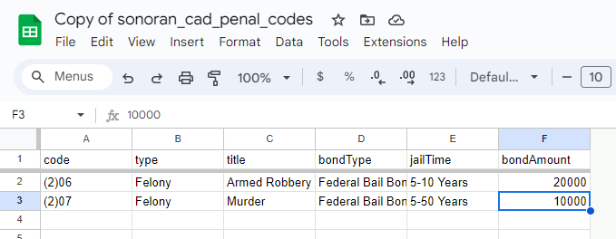
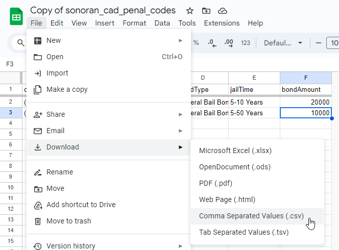

# Penal Codes

## What are penal codes?

<details>

<summary>Penal Codes Explained</summary>

Penal codes can easily be referenced and cited in records/reports as charges.

.png>)

.png>)

### 1. Charge Types

You can create your own "Charge Type" options for penal codes. If your country does not have "felonies" you can edit or remove this option.

You can also use the "Auto Sort" feature to quickly format the order of these charge types.

Be sure to hit "Save" before exiting the page.

.png>)

### 2. Bond Types

You can create your own "Bond'/Bail Type" options for penal codes. Again, if your country does not use these, you can edit or remove them as needed.

You can also use the "Auto Sort" feature to quickly format the order of these charge types.

.png>)

### 3. Penal Codes

Adding, editing, or removing a penal code is easy. Simply click on the existing code to edit it, or press "New Penal Code" to create a new one.

.png>)

.png>)

### 4. My locality doesn't call them "Penal Codes"

Sonoran CAD allows you to change the naming of "Penal Codes" to anything else you'd like.\
Learn more about our [geographical customization](geographical-settings.md).

</details>

## Import from Premade Spreadsheet (CSV)

We've compiled realistic, roleplay-focused penal code spreadsheets for all 50 US states and several popular international jurisdictions. Select a direct download below, then [import the CSV into the CAD](penal-codes.md#id-4.-import-the-csv-file).

<details>

<summary>United States — all 50 states</summary>

| State          | Premade CSV                                                                                         |
| -------------- | --------------------------------------------------------------------------------------------------- |
| Alabama        | [Download CSV](https://github.com/Sonoran-Software/CAD-Penal-Codes/raw/refs/heads/master/US_AL.csv) |
| Alaska         | [Download CSV](https://github.com/Sonoran-Software/CAD-Penal-Codes/raw/refs/heads/master/US_AK.csv) |
| Arizona        | [Download CSV](https://github.com/Sonoran-Software/CAD-Penal-Codes/raw/refs/heads/master/US_AZ.csv) |
| Arkansas       | [Download CSV](https://github.com/Sonoran-Software/CAD-Penal-Codes/raw/refs/heads/master/US_AR.csv) |
| California     | [Download CSV](https://github.com/Sonoran-Software/CAD-Penal-Codes/raw/refs/heads/master/US_CA.csv) |
| Colorado       | [Download CSV](https://github.com/Sonoran-Software/CAD-Penal-Codes/raw/refs/heads/master/US_CO.csv) |
| Connecticut    | [Download CSV](https://github.com/Sonoran-Software/CAD-Penal-Codes/raw/refs/heads/master/US_CT.csv) |
| Delaware       | [Download CSV](https://github.com/Sonoran-Software/CAD-Penal-Codes/raw/refs/heads/master/US_DE.csv) |
| Florida        | [Download CSV](https://github.com/Sonoran-Software/CAD-Penal-Codes/raw/refs/heads/master/US_FL.csv) |
| Georgia        | [Download CSV](https://github.com/Sonoran-Software/CAD-Penal-Codes/raw/refs/heads/master/US_GA.csv) |
| Hawaii         | [Download CSV](https://github.com/Sonoran-Software/CAD-Penal-Codes/raw/refs/heads/master/US_HI.csv) |
| Idaho          | [Download CSV](https://github.com/Sonoran-Software/CAD-Penal-Codes/raw/refs/heads/master/US_ID.csv) |
| Illinois       | [Download CSV](https://github.com/Sonoran-Software/CAD-Penal-Codes/raw/refs/heads/master/US_IL.csv) |
| Indiana        | [Download CSV](https://github.com/Sonoran-Software/CAD-Penal-Codes/raw/refs/heads/master/US_IN.csv) |
| Iowa           | [Download CSV](https://github.com/Sonoran-Software/CAD-Penal-Codes/raw/refs/heads/master/US_IA.csv) |
| Kansas         | [Download CSV](https://github.com/Sonoran-Software/CAD-Penal-Codes/raw/refs/heads/master/US_KS.csv) |
| Kentucky       | [Download CSV](https://github.com/Sonoran-Software/CAD-Penal-Codes/raw/refs/heads/master/US_KY.csv) |
| Louisiana      | [Download CSV](https://github.com/Sonoran-Software/CAD-Penal-Codes/raw/refs/heads/master/US_LA.csv) |
| Maine          | [Download CSV](https://github.com/Sonoran-Software/CAD-Penal-Codes/raw/refs/heads/master/US_ME.csv) |
| Maryland       | [Download CSV](https://github.com/Sonoran-Software/CAD-Penal-Codes/raw/refs/heads/master/US_MD.csv) |
| Massachusetts  | [Download CSV](https://github.com/Sonoran-Software/CAD-Penal-Codes/raw/refs/heads/master/US_MA.csv) |
| Michigan       | [Download CSV](https://github.com/Sonoran-Software/CAD-Penal-Codes/raw/refs/heads/master/US_MI.csv) |
| Minnesota      | [Download CSV](https://github.com/Sonoran-Software/CAD-Penal-Codes/raw/refs/heads/master/US_MN.csv) |
| Mississippi    | [Download CSV](https://github.com/Sonoran-Software/CAD-Penal-Codes/raw/refs/heads/master/US_MS.csv) |
| Missouri       | [Download CSV](https://github.com/Sonoran-Software/CAD-Penal-Codes/raw/refs/heads/master/US_MO.csv) |
| Montana        | [Download CSV](https://github.com/Sonoran-Software/CAD-Penal-Codes/raw/refs/heads/master/US_MT.csv) |
| Nebraska       | [Download CSV](https://github.com/Sonoran-Software/CAD-Penal-Codes/raw/refs/heads/master/US_NE.csv) |
| Nevada         | [Download CSV](https://github.com/Sonoran-Software/CAD-Penal-Codes/raw/refs/heads/master/US_NV.csv) |
| New Hampshire  | [Download CSV](https://github.com/Sonoran-Software/CAD-Penal-Codes/raw/refs/heads/master/US_NH.csv) |
| New Jersey     | [Download CSV](https://github.com/Sonoran-Software/CAD-Penal-Codes/raw/refs/heads/master/US_NJ.csv) |
| New Mexico     | [Download CSV](https://github.com/Sonoran-Software/CAD-Penal-Codes/raw/refs/heads/master/US_NM.csv) |
| New York       | [Download CSV](https://github.com/Sonoran-Software/CAD-Penal-Codes/raw/refs/heads/master/US_NY.csv) |
| North Carolina | [Download CSV](https://github.com/Sonoran-Software/CAD-Penal-Codes/raw/refs/heads/master/US_NC.csv) |
| North Dakota   | [Download CSV](https://github.com/Sonoran-Software/CAD-Penal-Codes/raw/refs/heads/master/US_ND.csv) |
| Ohio           | [Download CSV](https://github.com/Sonoran-Software/CAD-Penal-Codes/raw/refs/heads/master/US_OH.csv) |
| Oklahoma       | [Download CSV](https://github.com/Sonoran-Software/CAD-Penal-Codes/raw/refs/heads/master/US_OK.csv) |
| Oregon         | [Download CSV](https://github.com/Sonoran-Software/CAD-Penal-Codes/raw/refs/heads/master/US_OR.csv) |
| Pennsylvania   | [Download CSV](https://github.com/Sonoran-Software/CAD-Penal-Codes/raw/refs/heads/master/US_PA.csv) |
| Rhode Island   | [Download CSV](https://github.com/Sonoran-Software/CAD-Penal-Codes/raw/refs/heads/master/US_RI.csv) |
| South Carolina | [Download CSV](https://github.com/Sonoran-Software/CAD-Penal-Codes/raw/refs/heads/master/US_SC.csv) |
| South Dakota   | [Download CSV](https://github.com/Sonoran-Software/CAD-Penal-Codes/raw/refs/heads/master/US_SD.csv) |
| Tennessee      | [Download CSV](https://github.com/Sonoran-Software/CAD-Penal-Codes/raw/refs/heads/master/US_TN.csv) |
| Texas          | [Download CSV](https://github.com/Sonoran-Software/CAD-Penal-Codes/raw/refs/heads/master/US_TX.csv) |
| Utah           | [Download CSV](https://github.com/Sonoran-Software/CAD-Penal-Codes/raw/refs/heads/master/US_UT.csv) |
| Vermont        | [Download CSV](https://github.com/Sonoran-Software/CAD-Penal-Codes/raw/refs/heads/master/US_VT.csv) |
| Virginia       | [Download CSV](https://github.com/Sonoran-Software/CAD-Penal-Codes/raw/refs/heads/master/US_VA.csv) |
| Washington     | [Download CSV](https://github.com/Sonoran-Software/CAD-Penal-Codes/raw/refs/heads/master/US_WA.csv) |
| West Virginia  | [Download CSV](https://github.com/Sonoran-Software/CAD-Penal-Codes/raw/refs/heads/master/US_WV.csv) |
| Wisconsin      | [Download CSV](https://github.com/Sonoran-Software/CAD-Penal-Codes/raw/refs/heads/master/US_WI.csv) |
| Wyoming        | [Download CSV](https://github.com/Sonoran-Software/CAD-Penal-Codes/raw/refs/heads/master/US_WY.csv) |

</details>

<details>

<summary>International jurisdictions</summary>


Australia and the United Kingdom do not have one uniform nationwide penal code. The premade Australian file is for **New South Wales**, and the UK file is for **England and Wales**.

International files use local charge classifications and a `Court Determined` bail type. Review your [Charge Types](penal-codes.md#id-1.-charge-types) and [Bond Types](penal-codes.md#id-2.-bond-types) after importing.


| Jurisdiction               | Premade CSV                                                                                          |
| -------------------------- | ---------------------------------------------------------------------------------------------------- |
| Canada                     | [Download CSV](https://github.com/Sonoran-Software/CAD-Penal-Codes/raw/refs/heads/master/CA.csv)     |
| England and Wales          | [Download CSV](https://github.com/Sonoran-Software/CAD-Penal-Codes/raw/refs/heads/master/GB_EAW.csv) |
| New South Wales, Australia | [Download CSV](https://github.com/Sonoran-Software/CAD-Penal-Codes/raw/refs/heads/master/AU_NSW.csv) |
| New Zealand                | [Download CSV](https://github.com/Sonoran-Software/CAD-Penal-Codes/raw/refs/heads/master/NZ.csv)     |

</details>

## Import from Customized Spreadsheet (CSV)

<details>

<summary>Custom Spreadsheet Import</summary>

Sonoran CAD allows you to easily import your penal codes from a spreadsheet (.CSV) file.


**Spreadsheet (CSV) importing is only supported directly from Google sheets.**

Support will not be provided to users modifying their spreadsheets with Excel, or any other program. The official Google sheet includes specific safety checks preventing invalid formats, blank spaces, etc.


### 1. Copy the Google Sheet

Navigate to our [official penal code Google sheet](https://docs.google.com/spreadsheets/d/1Hcm0gHPq8nZx8aPetDRiQXgeAoQMz3CYk2ouwyabmOc/copy) and make a copy. Using a copy of our official sheet ensures your penal codes are formatted correctly.

**You may ONLY use the Google sheet directly. Editing this via Excel or any other program is NOT supported.**

.png>)

### 2. Add Your Penal Codes

Now that you have copied this sheet into your Google Drive, you can add new rows and format your penal codes.


**Do NOT modify the very first row.** These names must remain the same to properly format the penal code structure.

Additionally, the `bondAmount` column must be kept as a number.\
All other columns must be formatted as text.




### 3. Download the CSV

In Google Sheets, navigate to File > Download > Comma Separated Values (.csv) to download the file.



### 4. Import the CSV File

In Sonoran CAD, navigate to Admin > Customization > Penal Codes

In the penal codes section, select the "Import" button.\
Then, select "CSV" as the import type and select your downloaded CSV file.

.png>)

.png>)

After selecting the CSV file, your penal codes will be imported into the CAD and saved automatically.

</details>

<details>

<summary>Troubleshooting</summary>

Having issues importing your CSV? [Be sure you are using and editing our Google Sheet with the Google Sheets program only](penal-codes.md#1-copy-the-google-sheet).

Our Google sheet includes specific error checking and validation to handle common mistakes.\
**Support is not provided if you are using Excel, or any other program.**

</details>

## Import from JSON

<details>

<summary>JSON Import</summary>

You can also build and format your penal codes directly into JSON. These JSON formatted penal codes can be sent via our [API endpoint](../../api-integration/api-endpoints/general/set-penal-codes.md), or pasted directly into the UI for a more user-friendly experience.

### 1. Format the JSON Structure

The JSON structure is an object array. Be sure to strictly follow the format. All keys are strings, with the exception of `bondAmount` being a number.

```javascript
[
        {
            "code": "(2)06",
            "type": "Felony",
            "title": "Armed Robbery",
            "bondType": "Federal Bail Bond",
            "jailTime": "5-10 Years",
            "bondAmount": 20000
        },
        {
            "code": "(2)07",
            "type": "Felony",
            "title": "Murder",
            "bondType": "Federal Bail Bond",
            "jailTime": "5-50 Years",
            "bondAmount": 100000
        }
    ]
```

### 2. Import the JSON Structure

In Sonoran CAD, navigate to Admin > Customization > Penal Codes

In the penal codes section, select the "Import" button.\
Then, select "JSON" and paste the JSON object array of penal codes.

.png>)

.png>)

After pasting the JSON content, your penal codes will be imported into the CAD and saved automatically.

</details>
