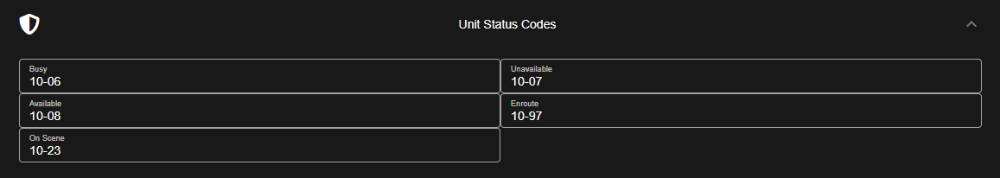

# Unit Status Codes


Community customization is not included with the free version.  
For more information, see our [pricing](https://sonorancad.com/app/#/pricing) or view how to check your community [limits](../getting-started/view-your-limits.md).


### Unit Status Codes

The admin customization info section allows you to customize your community's unit status codes:

Once saved, your status options will be shown for emergency units:

