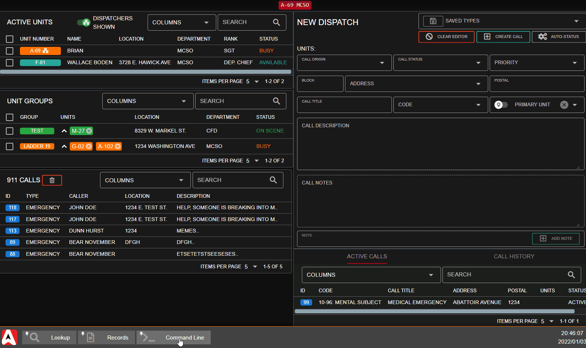

# Command Line Interface (CLI)

## UI Overview

The CLI allows you to more quickly run common dispatch actions without the need to move your mouse, click, or drag-and-drop. The CLI is optimized to make these actions as fast as possible.

### Accessing the CLI

#### Via Hotkey

The CLI can be brought up using a [global hotkey](../other-features/configurable-hotkeys.md). This will automatically open and focus your cursor in the first box, or maximize and focus a minimized CLI window tab.

#### Via Window Tab

You can also access the CLI from the start menu > `Dispatch` > `Command Line`

### Utilizing the CLI

The CLI is broken into four boxes. Each box has auto-complete as you type.

Press `Tab` or `Enter` on your keyboard when the filter is down to one option. This will auto-complete to the remaining option and focus your cursor into the next box.

If you've already completed the last box for the action type, `Tab` or `Enter` will automatically submit the command.

## Command List

| Box 1    | Box 2                                                  | Box 3           | Box 4       |
| -------- | ------------------------------------------------------ | --------------- | ----------- |
| `CREATE` | [Saved Call Type](creating-a-call.md#saved-call-types) | Unit Identifier | Postal Code |
| `CLOSE`  | Call ID Number                                         |                 |             |
| `ATTACH` | Call ID Number                                         | Unit Identifier |             |
| `DETACH` | Call ID Number                                         | Unit Identifier |             |
| `VIEW`   | Call ID Number                                         |                 |             |
| `CLEAR`  |                                                        |                 |             |
| `STATUS` | Status Code                                            | Unit Identifier |             |
| `NOTE`   | Call ID Number                                         |                 | Note Text   |

### Command Descriptions

* `CREATE`: Create a new dispatch call from a [saved type](creating-a-call.md#saved-call-types), specifying a unit and postal code.
* `CLOSE`: Close a dispatch call from the ID.
* `ATTACH`: Attach a unit to a dispatch call ID.
* `DETACH`: Detach a unit from a dispatch call ID.
* `VIEW`: View a dispatch call ID in the call editor.
* `CLEAR`: Clear the call editor.
* `STATUS`: Set a unit or group status.
* `NOTE`: Add a note to a dispatch call ID.
