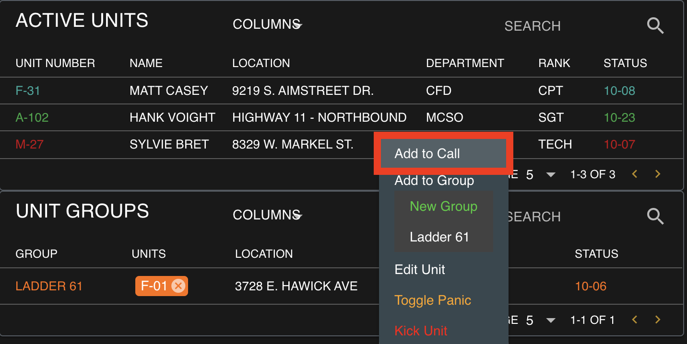
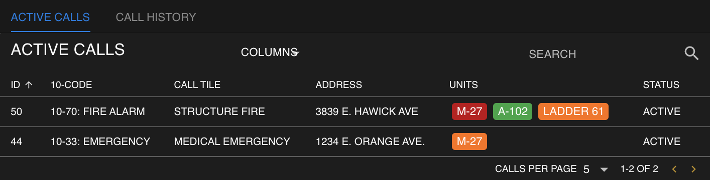
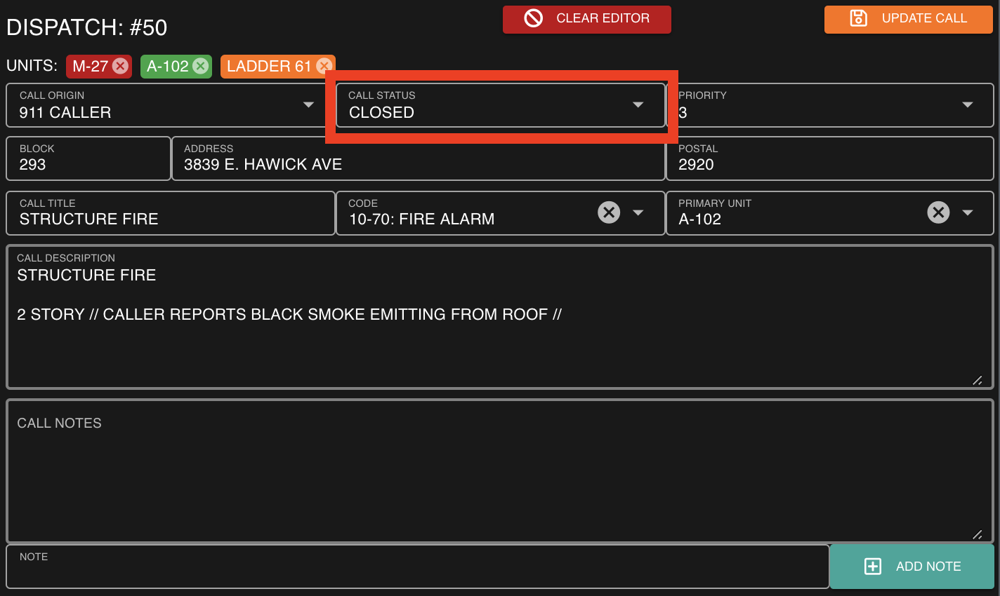

# Creating a Call

### Add Available Units

Click on an available unit or unit group, and select "Add to Call"

### Insert Call Information

In the call editor, view attached units and fill out the call information.  
Once completed, select "Create Call" to initiate the new dispatch call.

### Track, Update, and Manage the Call

The new dispatch will be displayed in your "Active Calls" window.  
You can select this call at anytime to preview, edit, or close.

### Close the Call

To close the active dispatch, edit the call and change the status to "Closed"

Don't forget to press save!

