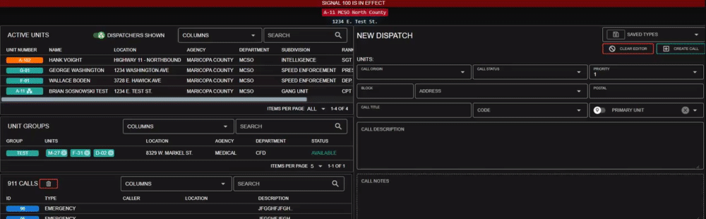
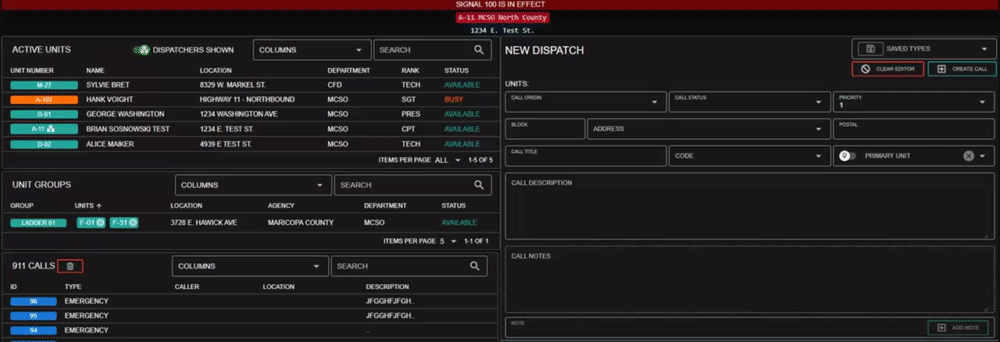
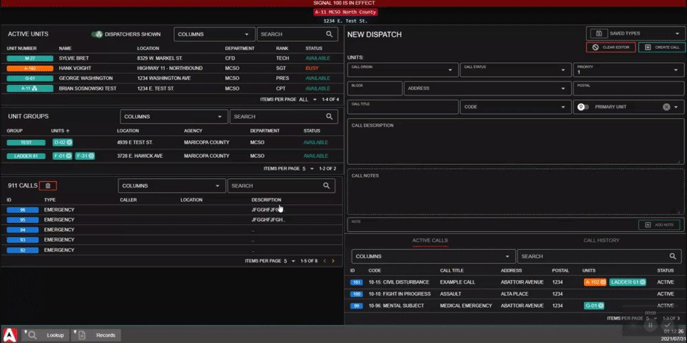
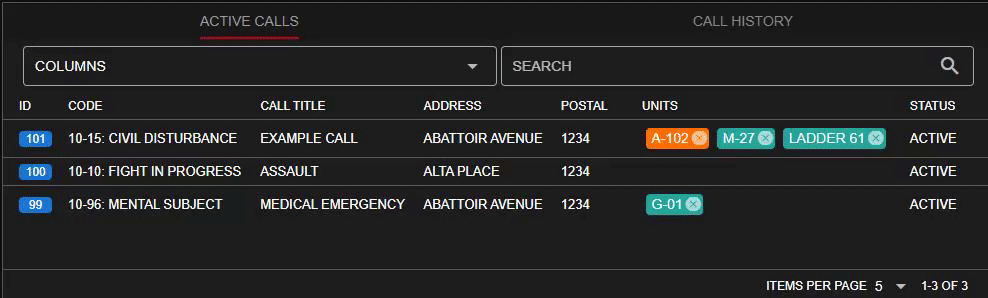

# Creating a Call

## Creating a Call

### Add Available Units

To add a unit to your call editor, click on an available unit or unit group, and select "Add to Call"

.png>)

Additionally, you can also drag-and-drop the unit number to your editor.

### Insert Call Information

In the call editor, you can view attached units and fill out the call information.\
Once completed, select "Create Call" to initiate the new dispatch call.

.png>)

### Track, Update, and Manage the Call

The new dispatch will be displayed in your "Active Calls" window.\
You can select this call at anytime to preview, edit, or close.

.png>)

### Call Notes

Notes can be sent by units attached to the call.

#### Text Notes

Text based notes can be added in the note box and sent by pressing `enter` or `add note`.

#### Note Links

Record links for characters, arrest reports, etc. can also be sent in the dispatch call notes section. [Copy a record link](../records-management/searching-for-records.md#copy-record-links), then press the `Paste` button in the call notes section.

<figure><figcaption>
Sonoran CAD - Dispatch Call Notes
</figcaption></figure>

### Close the Call

To close the active dispatch, click on the active call and press "Close Call".

Or, you can select "Edit Call", change the status to "Closed", and press "Update Call".

.png>)

## Unit Management

### Modifying Status

You can click on a unit's status for a dropdown menu to quickly modify it.

.png>)

### Modifying Information

Click on any active unit and select "Edit Unit" to change their identifier information.

.png>)

### Unit Groups

Unit groups are a way to combine two units together, typically when they're in the save vehicle or apparatus.

To add a unit to a group, simply select the unit and select "Add to Group" > New Group or an existing group

.png>)

Or, you can drag-and-drop a unit to the Unit Groups section.\
Drag it to the header to create a new group, or drag it to an existing group to add it.

### Unit Attachments

The fastest way to add a unit to an existing call, is to drag-and-drop it:

You can also easily detach units from an existing call, or drag a unit from one call to another:

## Saved Call Types

### Create a Saved Call Type

Saved call types allow dispatchers to quickly create commonly used calls.

To add a new saved call type, simply fill the information out in your editor, and press the save button. The saved types are organized based off of the call's title.

Saving a call with an identical title as another one will override it.

.png>)

### Open a Saved Call Type

To open a saved call type, simply select it from the dropdown at the top of the editor. The dropdown will also automatically filter as you type.

.png>)

### Remove a Saved Call Type

To remove a saved call type, simply select it from the dropdown and press the trash icon.

.png>)
