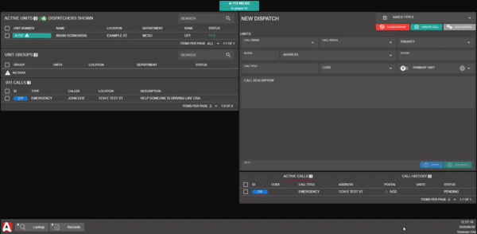

# Creating a Call

## Creating a Call

Add Available Units

#### Manually Add Unit

To add a unit to your call editor, click on an available unit or unit group, and select "Add to Call"

.png>)

#### Attach Nearest Units

When emergency calls are sent from in-game, they contain a coordinate location. Importing the emergency call from the table or live map will display an option to select and attach the closest units.

Entering a postal code will work as a secondary option to find the nearest units. You must have the [postals submodule](../../integration-plugins/in-game-integration/fivem-installation/available-plugins/postals.md) enabled.

<figure><figcaption>
Dispatch Editor: Nearest Units
</figcaption></figure> <figure><figcaption>
Dispatch Editor: Nearest Postal Units
</figcaption></figure>

#### Drag-and-Drop

Drag-and-drop is another fast way to add a unit to an existing call:

You can also easily detach units from an existing call, or drag a unit from one call to another:

Insert Call Information

In the call editor, you can view attached units and fill out the call information.\
Once completed, select "Create Call" to initiate the new dispatch call.

.png>)

## Manage a Call

Import Emergency Call

Emergency calls can be imported directly to the call editor for faster transfer of information. Click on the call to select `Open In Call Editor` to import the call description, address, and more.

<figure><figcaption>
Sonoran CAD: Import Emergency Call
</figcaption></figure>

Merge Additional Emergency Call

Often times civilians will continue to make additional emergency calls with updated information. At any time, you can merge these additional emergency calls into ongoing dispatch calls. Click on the emergency call to `Merge Emergency Call` to your dispatch call editor.

This will append the latest emergency call information to the description and update any address, postal, etc. information.

<figure><figcaption>
Sonoran CAD: Merge Emergency Call
</figcaption></figure>

Track, Update, and Manage the Call

The new dispatch will be displayed in your "Active Calls" window.\
You can select this call at anytime to preview, edit, or close.\
You can also drag-and-drop the call ID to the call editor to open the call.

.png>)

Call Notes

Notes can be sent by units attached to the call.

#### Text Notes

Text based notes can be added in the note box and sent by pressing `enter` or `add note`.

#### Note Links

Record links for characters, arrest reports, etc. can also be sent in the dispatch call notes section. [Copy a record link](../records-management/searching-for-records.md#copy-record-links), then press the `Paste` button in the call notes section.

<figure><figcaption>
Sonoran CAD - Dispatch Call Notes
</figcaption></figure>

Close the Call

To close the active dispatch, click on the active call and press "Close Call".

Or, you can select "Edit Call", change the status to "Closed", and press "Update Call".

.png>)

## Saved Call Types

Create a Saved Call Type

Saved call types allow dispatchers to quickly create commonly used calls.

To add a new saved call type, simply fill the information out in your editor, and press the save button. The saved types are organized based off of the call's title.

Saving a call with an identical title as another one will override it.

.png>)

Open a Saved Call Type

To open a saved call type, simply select it from the dropdown at the top of the editor. The dropdown will also automatically filter as you type.

.png>)

Remove a Saved Call Type

To remove a saved call type, simply select it from the dropdown and press the trash icon.

.png>)

Import/Export Saved Call Types

With a saved call type selected, the export button will allow you to save the current call type to a JSON file. Or, right-click the export button to export all of your saved call tyles to a JSON file.

<figure><figcaption></figcaption></figure>

To import saved call types, the import button will appear when no saved call is selected. Click the icon to import a JSON file with one or more saved call types.

<figure><figcaption></figcaption></figure>

