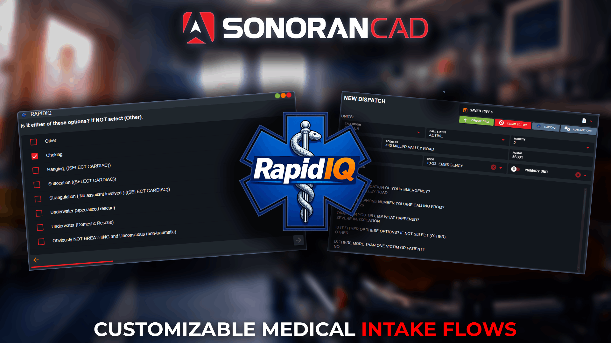

# Rapid IQ

<figure><figcaption></figcaption></figure>

## What is Rapid IQ?

**Rapid IQ** is an emergency call intake system that helps dispatchers ask the right questions during medical calls. It guides them step-by-step through a structured flow based on the caller’s answers, making sure important details aren’t missed.

Rapid IQ combines these responses into the dispatch call description, giving the best possible information to responding units.

## Using Rapid IQ

### Opening Rapid IQ

Via Call Editor

Select the **Rapid IQ** button at the top of the call editor to open the window.

<figure><figcaption></figcaption></figure>

Via Taskbar

In the taskbar, use the search box or navigate to **Dispatch** > **Rapid IQ** to open the window.

<figure><figcaption></figcaption></figure>

### Navigating Flows

Inputs

Rapid IQ is designed for quick, seamless information inputs.

**Text Inputs**

* Inputs are automatically focused
* Pressing **Enter** navigates to the next question
* Custom addresses are type-to-filter
  * If results are filtered to a single result, pressing **Enter** automatically selects it and navigates to the next question. Pressing **Enter** with more than one result left will select the top option.

**Checkbox Inputs**

* Type-to-filter search at the top is automatically focused
  * If results are filtered to a single result, pressing **Enter** automatically selects it and navigates to the next question. Pressing **Enter** with more than one result left will select the top option.
* Selecting a checkbox navigates to the next question

**Navigation**

* Use the **Left** and **Right** arrow keys to navigate forward and backwards manually

**Masks**

* Flow inputs that use a mask (strict formatting for numbers, text, symbols, etc.) will automatically navigate to the next question once all text has been entered

End Toggle Options

Once all information has been entered, Rapid IQ offers different data display options.

**Import to Call Editor**

When toggled, all information will be automatically imported into the dispatch call editor and the window will be automatically closed (unless **Display Card** is enabled).

This feature is automatically toggled on when opening Rapid IQ from the call editor.

<figure><figcaption></figcaption></figure> <figure><figcaption></figcaption></figure>

**Display Card**

When toggled, all information will be displayed in a card of questions and answers. Users can also press the **Copy** button (top right) to copy and paste all questions and answers elsewhere.

This feature is automatically toggled on when opening Rapid IQ from the taskbar.

<figure><figcaption></figcaption></figure> <figure><figcaption></figcaption></figure>

## Customizing Flows

