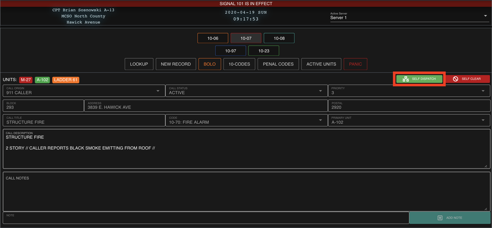
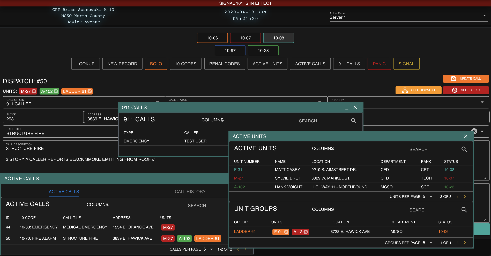

# Self Dispatch


Self Dispatch requires an additional user account permission!

Users will need the "Self Dispatch" permission to enable this feature. View our guide on [granting account permissions](../getting-started/permissions.md) for more information.


### Enable Self-Dispatch

In the top right of the call viewer, select "Self Dispatch"

### Add, Edit, or Attach

With self dispatch enabled, regular units can now open additional windows to view dispatch calls, 911 calls, and active units.

