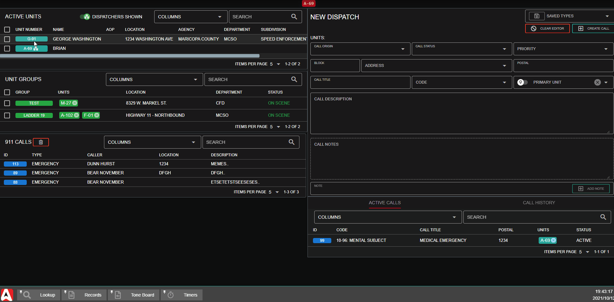
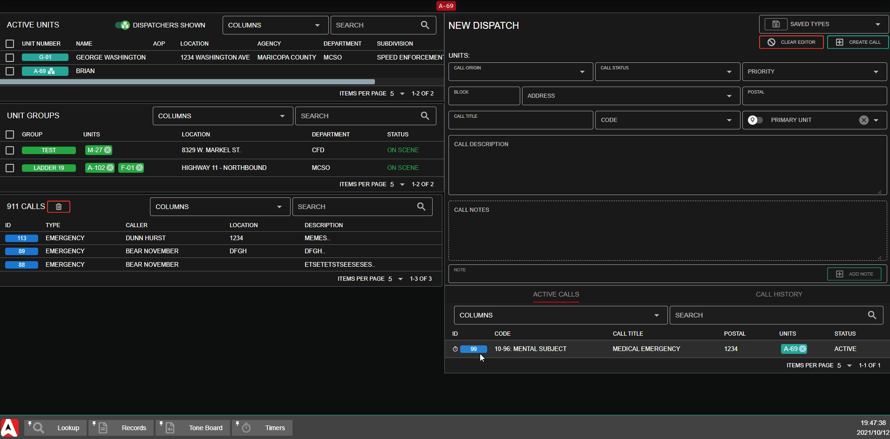
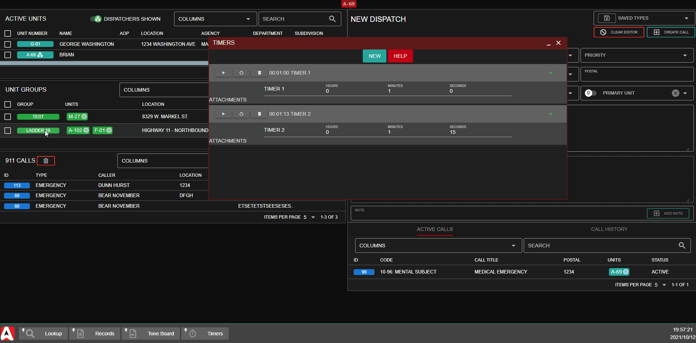

# Timers

## What are Dispatch Timers?

Sonoran CAD allows users to create custom dispatch timers. Some example use cases of these timers are as follows:

* Creating a 10 minute pursuit timer before authorizing a pit maneuver
* Reminders to periodically check in on a unit
* Reminders to check in on a specific dispatch call

When a timer has completed, it will flash an icon next to any [attachments ](timers.md#timer-attachments)and play a [customizable tone](../customization/custom-audio-notifications.md).

## Creating a New Timer

Dispatch timers can be created through multiple different shortcuts.

### Via the Timer Panel

From the start menu: `Unit Management` > `Timers`

Press `New` to create a new timer.

 (1) (1) (1).png>)

### Drag-And-Drop to Tab

If you have the timer [panel tab minimized or pinned](../customization/customizing-your-layout.md#7.-tab-system), you can drag a unit, group, or dispatch call right to the tab.

### From the Context Menu

Left click on a unit ID, group name, or dispatch call ID: `Timers` > `New Timer`

## Editing a Timer

### Via Timer Panel

The timer panel has options to start, pause, restart, and remove a timer.

Additionally, you can expand the timer to change the name and duration.

 (1) (1) (1).png>)

### Via the Context Menu

When a unit, group, or call is [attached to a timer](timers.md#undefined) you can click on the timer icon. A timer menu will be displayed, allowing you to start, pause, restart, or clear the timer's attachment.

 (1) (1).png>)

## Timer Attachments

You can attach a unit, group, or call to a timer. This will display a timer icon next to the attached unit or call. You can hover over this icon to view the remaining time, or click on it for the timer context menu.

### Via Drag-And-Drop

In addition to dragging a unit, group, or dispatch call to a minimized tab you can also drag it to a timer in the panel.

### Via Context Menu

Click on a unit, group, or dispatch call: `Timers` > `Select a Timer`

 (1) (1) (1).png>)

## Automations

Timers can also be created via [dispatcher automations](automations.md).
