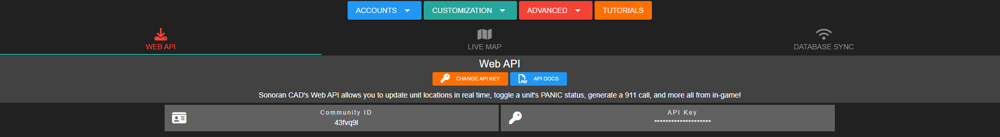
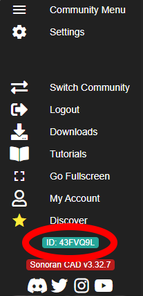
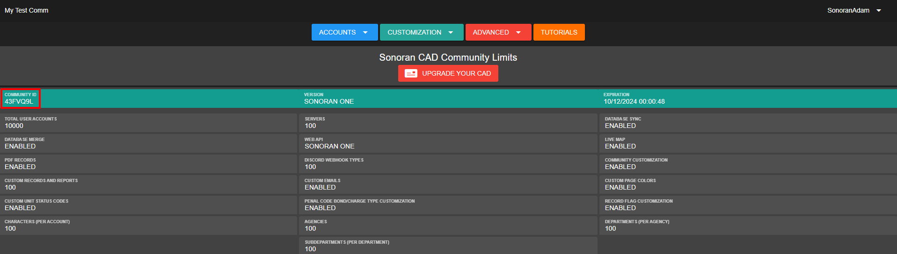

# Community ID and API Keys

## Explanation: API Keys and IDs

Within Sonoran CAD, there are two different types of API Keys that you will need to use, each serving a different purpose.&#x20;


API integration is not enabled with the free version of Sonoran CAD.\
For more information, see our [pricing](../../pricing/faq/) or view how to check your community [limits](view-your-limits.md).


#### **Community API Key**

First, there is your **community** API Key which allows CAD's in-game integrations to send data to the correct community.&#x20;

To find your community API Key, see [Retrieving Your Credentials](finding-your-community-id-and-authentication-code.md#retrieving-your-credentials) below.&#x20;

This key will be placed in your config.json (for [FiveM integration](/broken/pages/-M7AprAqKWbNHL1L7N0T)) or the Server Settings panel (for [ER:LC integration](../../integration-plugins/roblox-er-lc/)).

#### **User API ID**

In addition to the community API Key, each user will also have **their own** API ID, which allows CAD to associate the user's in-game player with their Sonoran account. Generally, this will either be the user's Steam Hex, Discord ID, or Game License Key.

This API ID can be found in game by doing `/apiid` in game, if you have the [apicheck](/broken/pages/-M7QrbOeDd37INb3cCg2) plugin installed.

Every user will need to find their own API ID and add it to CAD as shown [here](../../api-integration/getting-started/setting-your-api-id.md).

## Retrieving Your Credentials

Your community ID allows users to [manually join your community](inviting-users-to-your-cad.md).&#x20;

Your community ID and API Key can be found in the Admin panel, under `Advanced` > `In-Game Integration`. Under the Web API section, your Community ID and API key will be listed as shown:

Click either box to copy its corresponding value to your clipboard.

### Other Ways of Finding your Community ID

Your community ID is also listed in the following places:

1\. In the side navigation bar while logged in

2\. In the Admin panel under `Advanced` > `Limits`

## Authenticating your Ownership

While requesting support from an official Sonoran team member, you may be asked to authenticate your community's ownership.


Your community's ownership authentication code can only be retrieved from your CAD owner.\
\
This code is used in support tickets to confirm that you are the registered owner of the community. **NEVER** give this code out to anyone that is not a member of the Sonoran support team!


1. In the admin page, navigate to `Advanced` > `Authenticate`
2. Press the "Request Code" button
3.  Your ownership authentication code will be displayed on the screen

    <figure><figcaption></figcaption></figure>
