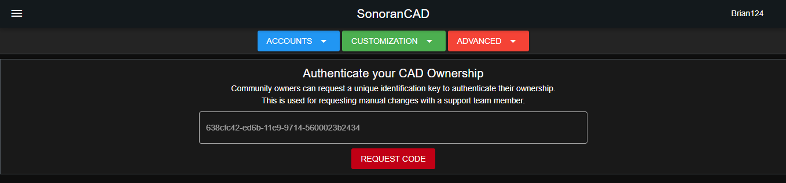

# Finding your Community ID and Authentication Code

### Finding your Community ID

Your community ID allows users to [manually join your community](inviting-users-to-your-cad.md).

Looking to [change your community ID](../customization/community-branding-and-info.md)?

#### 1. Your community ID is displayed in the side navigation bar while logged in:

#### 2. To find this ID in the admin page, navigate to `Advanced > Limits`

### Authenticating your Ownership

While requesting support from an official Sonoran team member, you may be asked to authenticate your community's ownership.


Your community's ownership authentication code can only be retrieved from your CAD owner.\
\
This code is used in support tickets to confirm that you are the registered owner of the community. **NEVER** give this code out to anyone that is not a member of the Sonoran support team!


1. In the admin page, navigate to `Advanced > Authenticate`
2. Press the "Request Code" button
3. Your ownership authentication code will be displayed on the screen

