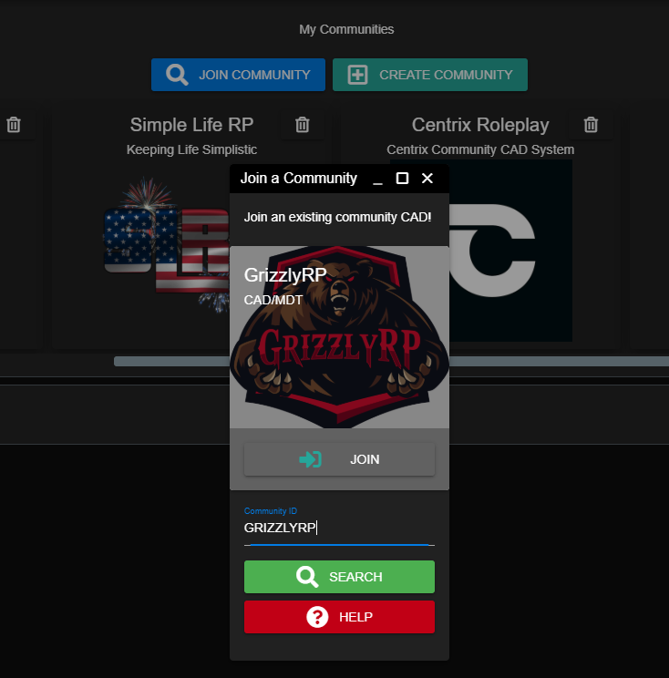

# Inviting Users to Your CAD

## Invitation Options

Sonoran CAD allows your community members to easily join your CAD. Users can manually enter in your community ID, or join automatically from a custom login page on your own domain.

### [Sonoran CMS Auto-Join](https://info.sonorancms.com/why-choose-sonoran-cms/why-choose-sonoran-cms)

[Sonoran CMS](https://info.sonorancms.com/why-choose-sonoran-cms/why-choose-sonoran-cms) can automatically add and remove accounts on your Sonoran CAD.

<figure><figcaption>
Sonoran CAD x Sonoran CMS - Account Auto-Join
</figcaption></figure>

### Custom Login Page

For more information on hosting your own custom login page, see our guide below:


[custom-login-page.md](../customization/custom-login-page.md)


### Manually Join with a Community ID

Users can [create an account](registering-your-account.md), and enter in your community ID in the "Join Community" popup.\
Users can search using your community ID and can press the "Join" button to add your community.\
\
From there, users can select your community card in the "My Communities" section to log into your CAD.


Forgot your community ID?

You can find this in your admin panel under Advanced > Limits > Community ID

