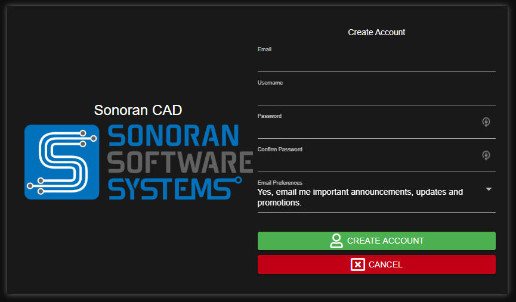

# Registering Your Account

#### 1. Navigate to the Login Page

On the website or app, select "Create Account"

#### 2. Enter Your Account Information

Enter in your email, username, and password. Then, select the green "Create Account" button.

#### 3. Verify Your Email Address


Account verification emails may not be shown in your primary inbox.

If you're having trouble finding the email, check your spam, junk, promotions, or all mail folder.


Check your inbox for an email from Sonoran CAD.  
  
Select the "Verify Email" button, and your account will be automatically verified.  

