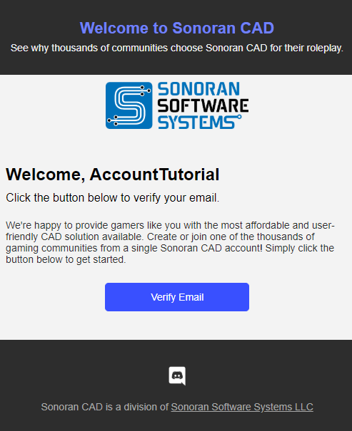

# Registering Your Account

#### 1. Navigate to the Login Page

On the website or app, select one of the login options:

<figure><figcaption></figcaption></figure>

Users can register a Sonoran Software account at [account.sonoransoftware.com](https://account.sonoransoftware.com/).

#### 2. Verify Your Email Address


Account verification emails may not be shown in your primary inbox.

If you're having trouble finding the email, check your spam, junk, promotions, or all mail folder.


If you've registered a new account, check your inbox for an email from Sonoran CAD.\
\
Select the "Verify Email" button, and your account will be automatically verified.\

