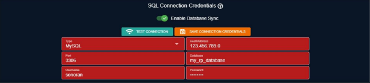
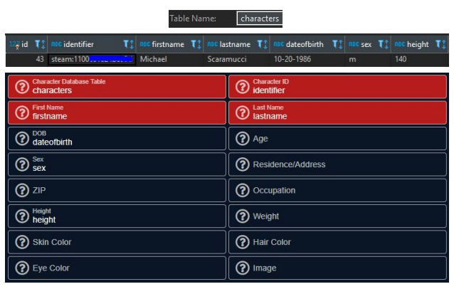

# Database Sync and Merge


Database Sync is not enabled with the free version of Sonoran CAD.  
For more information, see our [pricing](https://sonorancad.com/app/#/pricing) or view how to check your community [limits](../getting-started/view-your-limits.md).


Database Sync is a read-only system. All characters, licenses, and vehicle registrations pulled from your database can not be modified in the CAD.  
  
Database Merge allows you to save off additional, manually specified data in the CAD.

## Video Configuration Tutorial

View our [video tutorial](https://youtu.be/UfMup7KkpEg) on enabling Database Sync.

## Written Configuration Guide

Configuring Sonoran CAD's Database Sync may seem complicated, but you are simply specifying your table names and column values.

REQUIRED fields in the CAD are shown in red. All other fields are optional, and are not required to work properly.



### Connection Credentials


Sonoran CAD requires an **external** connection to your database.  
  
If you're unsure what your connection credentials are, it is highly recommended to first successfully connect to your database on **your own, external PC** first with a database viewer like [HediSQL](https://www.heidisql.com/). These same credentials will then work with Sonoran CAD.  
  
You will also need to ensure your database port is open and port forwarded. Typically, port`3306`is the default MySQL port.



Sonoran CAD never needs any permissions to write to your database.  
To follow the best security practices, it's recommended to create a new MySQL user with read-only permissions on your database tables.


In order for Sonoran CAD to connect to your SQL database, connection credentials must be configured properly.  
This section specifies the SQL connection string information.

#### 1. Toggle the “Enable Database Sync”

#### 2. Enter the required fields below.



<table>
  <thead>
    <tr>
      <th style="text-align:left">Field</th>
      <th style="text-align:left">Description</th>
    </tr>
  </thead>
  <tbody>
    <tr>
      <td style="text-align:left">Type</td>
      <td style="text-align:left">This is the type of SQL database your server is using (MySQL, PostgreSQL,
        etc.)</td>
    </tr>
    <tr>
      <td style="text-align:left">Host/Address</td>
      <td style="text-align:left">
        <p>This is the <b>external </b>IP address or domain address to your SQL database.
          <br
          />
        </p>
        <p><em>Note:</em> This IP will never be <code>localhost</code> or <code>127.0.0.1</code>.
          This must be the external IP or domain to reach your database. See the
          warnings/notices above on creating an external connection.</p>
      </td>
    </tr>
    <tr>
      <td style="text-align:left">Port</td>
      <td style="text-align:left">This is the port your database is accessible from. Typically, the default
        port for MySQL is 3306.</td>
    </tr>
    <tr>
      <td style="text-align:left">Database</td>
      <td style="text-align:left">This is the database or schema name that contains your community&#x2019;s
        character, license and vehicle registration tables.</td>
    </tr>
    <tr>
      <td style="text-align:left">Username</td>
      <td style="text-align:left">This is the SQL account username.</td>
    </tr>
    <tr>
      <td style="text-align:left">Password</td>
      <td style="text-align:left">This is the password for the SQL account.</td>
    </tr>
  </tbody>
</table>

#### 3. Test the Connection

Once the required SQL connection fields have been specified, select the “Test Connection” button.  
This will query your database for the version.  
  
If you see an alert similar to the following, your connection is successful:


#### 4. Save the Configuration

If the test was successful, press “Save Connection Credentials” and continue.



### Character Mapping


_NOTE:_ Sonoran CAD requires character mapping for characters, licenses and vehicle registrations.


#### 1. Toggle the “Enable Character Mapping”

#### 2. Enter the required fields below. Leave any fields that you do not have blank

| Field | Description |
| :--- | :--- |
| Character Table | This is the name of the table that contains your characters. |
| Character ID | This is name of the column containing the unique ID of your character.   **IMPORTANT:** This ID is used to link licenses and vehicle registrations to a character. Typically this is a Steam ID, but can be any unique character identifier that maps to licenses and vehicle registrations. |
| First Name | This is the name of the column containing the character’s first name. |
| Last Name | This is the name of the column containing the character’s last name. |
| DOB | This is the name of the column containing the character’s date of birth. |
| Age | This is the name of the column containing the character’s age. |
| Sex | This is the name of the column containing the character’s sex. |
| Address | This is the name of the column containing the character’s address. |
| Zip Code | This is the name of the column containing the character’s ZIP code. |
| Occupation | This is the name of the column containing the character’s occupation/job. |
| Height | This is the name of the column containing the character’s height. |
| Weight | This is the name of the column containing the character’s weight. |
| Skin Color | This is the name of the column containing the character’s skin color. |
| Hair Color | This is the name of the column containing the character’s hair color. |
| Eye Color | This is the name of the column containing the character’s eye color. |
| Image URL | This is the name of the column containing a URL to the character’s image. |

Below is an example of a mapping from a character table:




Note: As shown in the figures above, the table name and column names are directly entered into the corresponding fields.


#### 3. Test the Mapping

Once the required character mapping fields have been specified, select the “Test Character Mapping” button.  
This will query your database for one character row with all of the columns you have specified.  
  
If you see an alert similar to the following, your mapping is valid.


**4. Save the Configuration**

If the test was successful, press “Save Character Mapping” and continue.



### License Mapping


_NOTE:_ Sonoran CAD requires valid character mapping in order to search and pull license information. The owner ID on the license record is used to map the license to a corresponding character ID.


#### 1. Toggle the “Enable License Mapping”

#### 2. Enter the required fields below. Leave any fields that you do not have blank.

| Field | Description |
| :--- | :--- |
| License Table | This is the name of the table that contains your licenses |
| Primary Key | This is the name of your licensing table’s primary key/unique index. |
| Owner ID | This is name of the column containing the unique ID of the character that owns this license.  **IMPORTANT:** This ID is the same character ID specified in the character mapping above. Typically this is a Steam ID, but can be any unique character identifier. |
| Type | This is the name of the column containing the license type. This could contain values like “DRIVERS”, “CDL”, “Firearm”, etc. |
| Status | This is the name of the column containing the license status. This could contain values like “ACTIVE”, “SUSPENDED”, “REVOKED”, etc. |
| Expiration | This is the name of the column containing the license expiration date. |

Below is an example of a mapping from a license table:



_Note:_ As shown in the figures above, the table name and column names are directly entered into the corresponding fields.


#### 3. Test the Configuration

Once the required license mapping fields have been specified, select the “Test License Mapping” button.  
This will query your database for one license row with all of the columns you have specified.  
  
If you see an alert similar to the following, your mapping is valid:


#### 4. Save the Configuration

If the test was successful, press “Save License Mapping” and continue.



### Vehicle Registration Mapping


_NOTE:_ Sonoran CAD requires valid character mapping in order to search and pull vehicle registration information. The owner ID on the vehicle registration record is used to map the license to a character.


#### 1. Toggle the “Enable Vehicle Mapping”

#### 2. Enter the required fields below. Leave any fields that you do not have blank.

| Field | Description |
| :--- | :--- |
| Vehicle Table | This is the name of the table that contains your vehicle registrations. |
| Primary Key | This is the name of your vehicle registration table’s primary key/unique index. |
| Owner ID | This is name of the column containing the unique ID of the character that owns this vehicle registration.  **IMPORTANT:** This ID is the same character ID specified in the character mapping above. Typically this is a Steam ID, but can be any unique character identifier. |
| Plate | This is the name of the column containing the vehicle's license plate. |
| Type | This is the name of the column containing the vehicle type. This could contain values like “CAR”, “TRUCK”, “SUV”, etc. |
| Make | This is the name of the column containing the vehicle make. |
| Model | This is the name of the column containing the vehicle model. |
| Color | This is the name of the column containing the vehicle color. |
| Year | This is the name of the column containing the vehicle year |
| Expiration | This is the name of the column containing the vehicle registration expiration date. |
| Status | This is the name of the column containing the vehicle status. This could contain values like “VALID”, “STOLEN”, etc. |

Below is an example of a mapping from a vehicle registration table:



_Note:_ As shown in the figures above, the table name and column names are directly entered into the corresponding fields.


#### 3. Test the Configuration

Once the required vehicle registration mapping fields have been specified, select the “Test Vehicle Mapping” button.  
This will query your database for one vehicle registration record with all of the columns specified.  
  
If you see an alert similar to the following, your mapping is valid:


#### 4. Save the Configuration

If the test was successful, press “Save Vehicle Mapping” and continue.



### Advanced - JSON

Some communities may store values in a JSON column. The following example pulls the `color` key value from a JSON column named `vehicleinfo`.

```javascript
// Example of JSON column "vehicleinfo"
{
    "color": "Red",
    "type": "SUV",
    "somethingElse": "Some Value"
}
```






