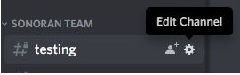
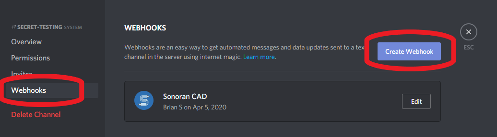
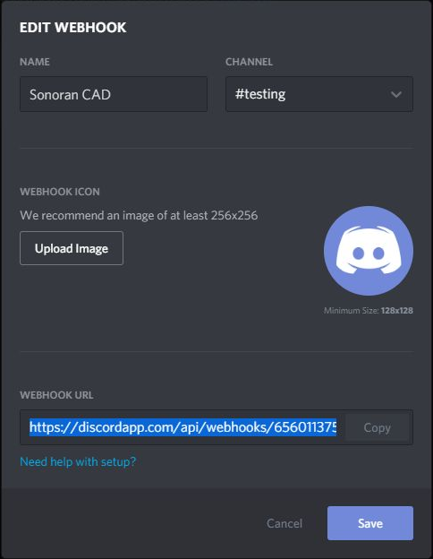

# Discord Webhooks


The free version of Sonoran CAD is limited to one \(1\) Discord webhook.  
For more information, see our [pricing](https://sonorancad.com/app/#/pricing) or view how to check your community [limits](../getting-started/view-your-limits.md).



Currently, Discord webhooks can only be created using the Desktop version of Discord.


### 1. Generate a Webhook URL

Select the “Edit Channel” button \(gear icon\) for the text channel in your Discord server where you would like to receive a specific WebHook from Sonoran CAD.

In the channel editor, select the “Webhooks” tab and press “Create Webhook.”

In the “Edit Webhook” modal, name the webhook and copy the webhook URL. Then, press “Save"

### 2. Configure the Sonoran CAD Webhook

In the Sonoran CAD Admin panel, select “Advanced &gt; Discord Integration”  
Paste your Webhook URL in the desired webhook configuration box.  
Toggle the desired notification events for the specific webhook. Press the “Save Configuration” button.


_Note:_ Some webhooks allow you to customize the notification settings even further. For example, you can specify to only receive a webhook when a police record is added, edited or removed.


