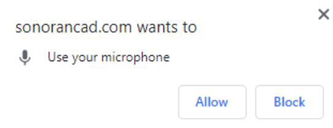

# Voice Commands


Currently, Sonoran CAD only supports voice commands in the **Chrome desktop browser**. 

Voice recognition is provided by Google, and performance may vary based upon pronunciation, speed, and other factors.


### 1. Enable Microphone Access

When navigating to a page with voice commands enabled, the browser will prompt you for microphone access.



### 2. Ensure Your Microphone is being Received

Now that microphone access has been granted, a red circle will appear at the top right of the browser tab.


### 3. Test out the Voice Commands

Your keyword can be changed from "Sonoran" to something customizable. For more information, check out our guide on [custom voice command keywords](../customization/community-branding-and-info.md).

#### PANIC

```text
Sonoran, Panic
```

#### Lookup Name

```text
Sonoran, lookup name John Doe
```

#### Lookup Plate

```text
Sonoran, lookup plate ABCD1234
```


