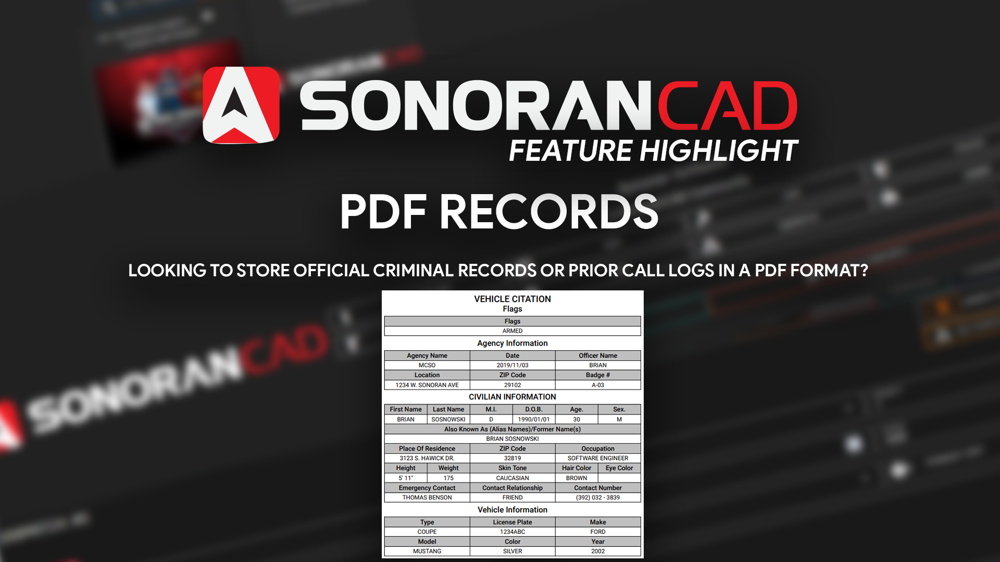

# PDF Records


PDF records are not included with the free version.\
For more information, see our [pricing](../../pricing/faq/) or view how to check your community [limits](../getting-started/view-your-limits.md).



Having trouble opening the PDF in the web version?

Your Ad-Blocker may be preventing the PDF from opening in a new window. Disable your Ad-Blocker on our website to prevent this issue.


<figure><figcaption></figcaption></figure>

### Records

To download a PDF copy of a criminal or civilian record, select the PDF button in the bottom action bar.

### Call Logs

Prior call logs can also be printed to a PDF record.

1. Navigate to the "Active Calls" window
2. Select the "Call History" tab
3. Click the call and select "Print Call"

