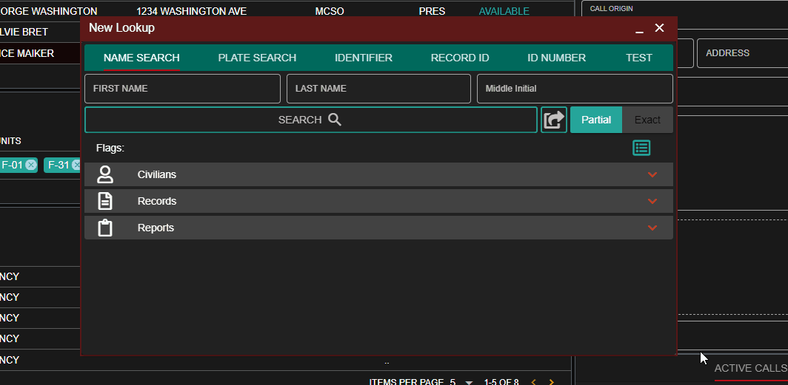

# Record Lookups

## Getting Started

From the start menu select `Record Management` &gt; `Lookup` to open a new lookup window.  
You can also [minimize and pin this window type](../customization/customizing-your-layout.md#7-tab-system) to your taskbar for faster access.

## Running a Search

The lookup window has tabs at the top to search via name, license plate, unit identifier, record ID, or one of your [custom lookup types](../customization/custom-search-types.md).

### Partial vs Exact Lookups

The lookup window allows you to toggle the search to return only exact matches, or partial matches.

#### Example: Partial Search

Running partial lookup on `John Anderson` will return results for `John Anderson` and `John Handerson`.

Running an exact lookup on `John Anderson` will only return results for `John Anderson` as `Handerson` is not an exact last name match.

### Record Type Filters

Click on the filter button just above the results tab to expand the filters section.

Here, you can toggle on/off exactly what record types to search for.

### Send Lookup to Units

Anyone on the Dispatcher page, or in self-dispatch mode has the option to send the lookup results to other units. Performing this action will have all record results sent to their CAD.

#### Shortcut and Drag-and-Drop

You can click on any active unit and select `Lookup` to open a new lookup window with this unit added, or have it added to any existing lookup windows.

Additionally, units and unit groups can be dragged-and-dropped directly to the lookup window.

#### Manual Search and Selection

Next to the search button, you can click on the `Send to Unit(s)` button to toggle this mode on.

Using the dropdown, you can type to filter active units or select them from the list directly.

### Lookup from Plate Lock

Our [Wraith radar plugin](../../integration-plugins/integration-plugins/available-plugins/wraithv2.md) allows you to lock your plate reader in-game and have the lookup automatically ran in your CAD.

### Voice Commands

Lookups can also be ran via a search [voice command](../other-features/voice-commands.md).

### PDF Printing

Any record results returned can be opened and printed to [PDF](pdf-records.md).

## 

