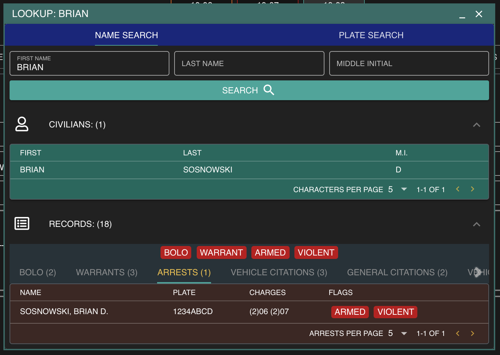

# Searching for Records

### Open a Lookup Window

In the top action bar, select "New Lookup"

### Search a Name or License Plate

Enter a name or license plate to search. All related civilian characters and criminal records will be displayed below. You can also run a search via [voice command](../other-features/voice-commands.md).

All warning flags will be prominently displayed and read aloud via text-to-speech. Select a record to view or even [print to PDF](pdf-records.md)!

## 

