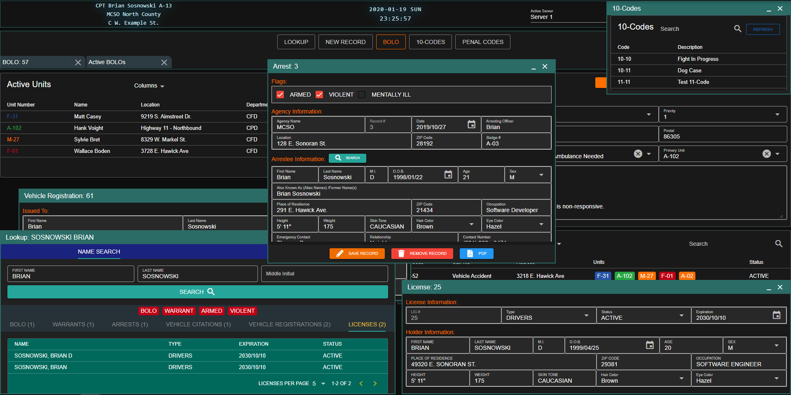

# Why Choose Sonoran CAD

### Downloadable Apps

In addition to our web version, you can download Sonoran CAD on the [iOS App Store](https://apps.apple.com/us/app/sonoran-cad/id1496539456), the [Google Play Store](https://play.google.com/store/apps/details?id=sonorancadmdt.app&hl=en_US), or for [Windows Desktop](https://github.com/SonoranBrian/sc2_quasar/releases/latest/download/Sonoran-CAD-Setup.exe).  
  
It has never been more easy to access your community's CAD system, regardless of what platform you're on!

### Database Sync

Tired of having to manually register civilians? With Sonoran CAD's [Database Sync](../tutorials/in-game-integration/database-sync-and-merge/), all of your in-game characters, licenses, and vehicle registrations are automatically in your CAD!

### In-Game Integration Plugins

Sonoran CAD's integration framework includes **over a dozen drag-and-drop plugins** for your game server!

* [Automated Plate Reader Lookup \(Results Sent Back to CAD\)](../integration-plugins/integration-plugins/available-plugins/wraithv2.md)
* [Automated Traffic Stop Dispatching](../integration-plugins/integration-plugins/available-plugins/traffic-stop.md)
* [Live Unit Locations](../integration-plugins/integration-plugins/available-plugins/locations.md)
* [/911, /511, /311 and /Panic](../integration-plugins/integration-plugins/available-plugins/call-commands.md)
* [Custom Integrated Live Map](../integration-plugins/integration-plugins/available-plugins/live-map/)
* And much more!

In addition to our [plugin system](../integration-plugins/integration-plugins/), you can write your own integration plugins using our [API documentation](../sonoran-cad/api-integration/).

View one of our plugin showcase videos [here](https://www.youtube.com/watch?v=pfE3HdCF20o)!

### Live Map

Sonoran CAD's custom[ live map plugin](../integration-plugins/integration-plugins/available-plugins/live-map/) even shows your unit identifier information in real time!

### Custom Records and Reports

Create your very own [custom report and record formats](../tutorials/customization/creating-custom-record-and-report-types.md) for your community to use!

Whether it's your own firearms registration system, an in-depth vehicle accident report format, or a custom incident record, Sonoran CAD allows you to customize it all.

### Custom Branding

Sonoran CAD enables you to place your community's name and [branding](../tutorials/customization/community-branding-and-info.md) in the CAD, [customize user account emails](../tutorials/customization/custom-emails.md), host a [custom login page](../tutorials/customization/custom-login-page.md) on **your own domain**, and more!

### Multitasking Window and Tab System

Only Sonoran CAD lets you easily multitask and open multiple search windows, records, penal codes references, ten code lists, and more! Our workflow allows you to handle even the most complicated and demanding patrols.

### Self-Dispatch

Don't have a dedicated dispatcher for your community?  
Sonoran CAD allows your units to easily [self-dispatch](../tutorials/dispatching/self-dispatch.md), attach to calls, preview other open calls, and more!

### PDF Records

Looking to store official criminal records or prior call logs in a PDF format? Sonoran CAD allows you to easily view and [print records to PDF](../tutorials/records-management/pdf-records.md).

### Global Hotkeys

Only Sonoran CAD allows you to configure customizable [hotkeys](../tutorials/other-features/configurable-hotkeys.md) for quick actions in the CAD. With our [Desktop application](../downloads.md), hotkeys are even registered globally and do not require the application to be visible or in-focus to trigger commands.

### Voice Commands

Common tasks are made even easier with our [voice commands](../tutorials/other-features/voice-commands.md). Sonoran CAD allows you to easily lookup a civilian's name, a vehicle license plate, or trigger a panic tone completely hands free!

### Frequent Updates

As shown in our [chanagelog](../roadmap/changelog.md), new features, fixes, and suggestions are added all the time!

